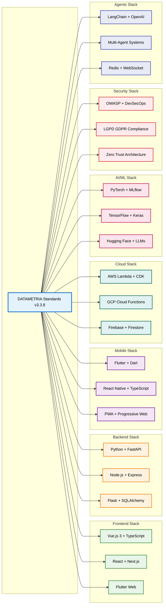
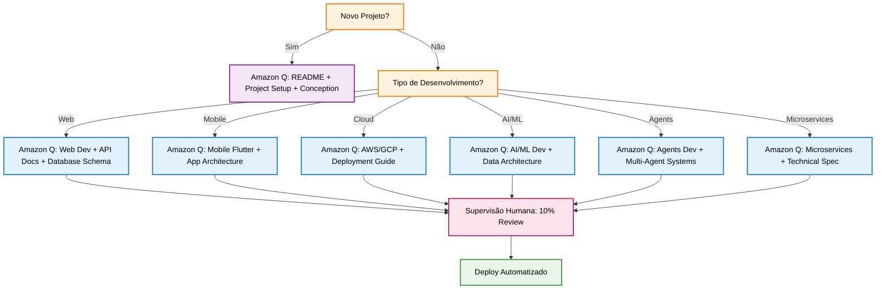
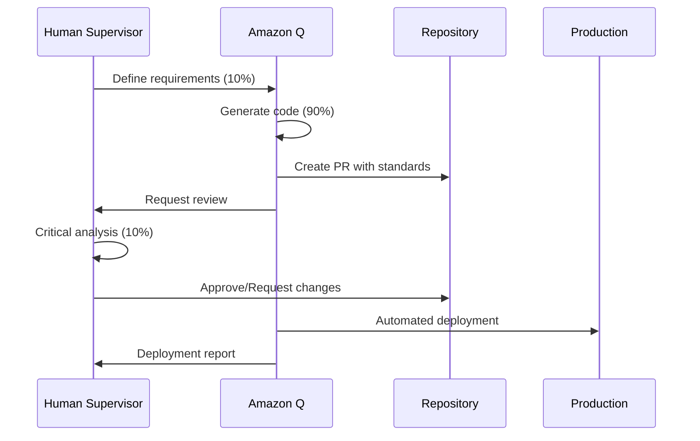

# 🎯 CONTEXTO MESTRE - PADRÕES E TEMPLATES DATAMETRIA

<div align="center">

## Índice Central e Referência Principal - Framework Completo DATAMETRIA v3.3.8

[](https://github.com/datametria/DATAMETRIA-standards)
[](https://github.com/datametria/DATAMETRIA-standards/blob/main/.amazonq/rules/datametria_context_master.md)
[](https://aws.amazon.com/q/)
[](https://aws.amazon.com/q/)
[](https://github.com/datametria/DATAMETRIA-standards/releases)

[📖 Como Usar](#-como-usar-este-documento) • [🏗️ Standards](#️-padrões-de-desenvolvimento-standards) • [📝 Templates](#-templates) • [🎯 Guia de Uso](#-quando-usar-cada-padrãotemplate)

</div>

---

## 📖 Como usar este documento

Este arquivo serve como **índice central** para todos os padrões e templates utilizados nos projetos da Datametria. É a **referência principal** para o Amazon Q Developer e supervisores humanos, garantindo conformidade e consistência em 100% dos projetos.

### 🤖 AI-First Development Context

**Modelo DATAMETRIA**: 90% Amazon Q Developer + 10% Supervisão Humana

```xml
<context>
  <source file="datametria_context_master.md">
    <ai_execution>90%</ai_execution>
    <human_supervision>10%</human_supervision>
    <section>Padrões de Desenvolvimento</section>
    <document>datametria_std_web_dev.md</document>
    <template>template-readme.md</template>
  </source>
</context>
```

### 📋 Estrutura de Referência

| Componente | Quantidade | Descrição | AI-Ready |
|------------|------------|-----------|----------|
| **📖 Standards** | 16 diretrizes | Padrões de desenvolvimento | ✅ 100% |
| **📝 Templates** | 51+ templates | Artefatos de projeto | ✅ 100% |
| **🔄 Cross-References** | 400+ links | Matriz de relacionamentos | ✅ 100% |
| **🤖 AI Integration** | Nativo | Amazon Q Developer | ✅ 100% |

---

## 🏗️ Padrões de Desenvolvimento (Standards)

### Stack Tecnológico Completo - 16 Diretrizes

| Diretriz | Arquivo | Tecnologias Principais | Seções | AI-Optimized |
|----------|---------|----------------------|--------|--------------|
| **🌐 Web Development** | `datametria_std_web_dev.md` | Flask + Vue.js 3 + SQLAlchemy + Docker | 14 | ✅ |
| **🐍 Python + Automação** | `datametria_std_python_automation.md` | Python + Poetry + Pywinauto + Testing | 9 | ✅ |
| **☁️ AWS Development** | `datametria_std_aws_development.md` | Lambda + CDK + Step Functions + FinOps | 9 | ✅ |
| **☁️ GCP + Firebase** | `datametria_std_gcp_firebase.md` | Cloud Functions + Firestore + Firebase | 9 | ✅ |
| **🎨 UX/UI Design** | `datametria_std_ux_ui.md` | Figma + Vue Material + Flutter + WCAG | 12 | ✅ |
| **📚 Documentação** | `datametria_std_documentation.md` | Markdown + Templates + Amazon Q | 11 | ✅ |
| **📊 Logging Enterprise** | `datametria_std_logging.md` | Python Logging + LGPD/GDPR + Compliance | 9 | ✅ |
| **🔒 Security Development** | `datametria_std_security.md` | OWASP + LGPD/GDPR + DevSecOps | 10 | ✅ |
| **📱 Mobile Flutter** | `datametria_std_mobile_flutter.md` | Flutter + Dart + Clean Architecture | 14 | ✅ |
| **📱 Mobile React Native** | `datametria_std_mobile_react_native.md` | React Native + TypeScript + Expo + Zustand | 15 | ✅ |
| **🛡️ Reverse Engineering Prevention** | `datametria_std_reverse_engineering_prevention.md` | Obfuscation + Protection + Monitoring | 8 | ✅ |
| **📊 Data Architecture & Engineering** | `datametria_std_data_architecture_engineering.md` | Apache Spark + Kafka + Airflow + Data Lake | 9 | ✅ |
| **🤖 AI/ML Development** | `datametria_std_ai_ml_development.md` | MLflow + PyTorch + TensorFlow + LLMs | 9 | ✅ |
| **🏢 Microservices Architecture** | `datametria_std_microservices_architecture.md` | Docker + Kubernetes + API Gateway + Service Mesh | 12 | ✅ |
| **🎨 Flow Designer** | `datametria_std_flow_designer.md` | Figma + Workflow Design + Process Automation | 8 | ✅ |
| **🤖 Agents Development** | `datametria_std_agents_development.md` | LangChain + OpenAI + Redis + Multi-Agent Systems | 16 | ✅ |

### Cobertura Multi-Platform



---

## 📝 Templates

### Framework Completo - 51+ Templates Organizados

#### 📄 Documentação de Projeto (8 templates)

| Template | Arquivo | Propósito | AI-Ready | Diretriz |
|----------|---------|-----------|----------|----------|
| **README** | `template-readme.md` | Documentação principal do projeto | ✅ | Documentação |
| **Changelog** | `template-changelog.md` | Histórico de mudanças | ✅ | Documentação |
| **Release Notes** | `template-release-notes.md` | Notas de lançamento | ✅ | Documentação |
| **Project Conception** | `template-project-conception.md` | Concepção e visão do projeto | ✅ | UX/UI Design |
| **Project Kickoff** | `template-project-kickoff.md` | Início de projeto | ✅ | Documentação |
| **Project Setup** | `template-project-setup.md` | Configuração inicial | ✅ | Documentação |
| **Developer Guide** | `template-developer-guide.md` | Guia completo do desenvolvedor | ✅ | Todas |
| **Developer Onboarding** | `template-developer-onboarding.md` | Onboarding de desenvolvedores | ✅ | Documentação |

#### 🏗️ Documentação Técnica (9 templates)

| Template | Arquivo | Propósito | AI-Ready | Diretriz |
|----------|---------|-----------|----------|----------|
| **ADR** | `template-adr.md` | Decisões arquiteturais | ✅ | Web/AWS/Mobile |
| **API Documentation** | `template-api-documentation.md` | Documentação de APIs | ✅ | Web Development |
| **Class Reference** | `template-class-reference.md` | Referência de classes | ✅ | Python Automation |
| **Docstring Google Style** | `template-docstring-google-style.md` | Documentação inline | ✅ | Python Automation |
| **Database Schema** | `template-database-schema-documentation.md` | Documentação de BD | ✅ | Web Development |
| **Technical Specification** | `template-technical-specification.md` | Especificação técnica | ✅ | Web/AWS/GCP |
| **Technical Architecture Diagram** | `template-technical-architecture-diagram.md` | Diagramas arquiteturais | ✅ | Todas |
| **Mermaid Guide** | `template-mermaid-guide.md` | Guia completo de diagramas Mermaid | ✅ | Documentação |
| **Environment Setup** | `template-environment-setup.md` | Configuração de ambiente | ✅ | Todas |

#### 📊 Gestão de Projeto (8 templates)

| Template | Arquivo | Propósito | AI-Ready | Diretriz |
|----------|---------|-----------|----------|----------|
| **Product Backlog** | `template-product-backlog.md` | Gestão de produto | ✅ | UX/UI Design |
| **Feature Documentation** | `template-feature-documentation.md` | Documentação de funcionalidades | ✅ | Todas |
| **Code Review** | `template-code-review.md` | Revisão de código | ✅ | Security Development |
| **Project Status Report** | `template-project-status-report.md` | Status de projeto | ✅ | Documentação |
| **MVP Planning** | `template-mvp-planning.md` | Planejamento de MVP | ✅ | UX/UI Design |
| **AI-First Time Estimation** | `template-ai-first-time-estimation.md` | Estimativas AI-First | ✅ | Todas |
| **Git Workflow** | `template-git-workflow.md` | Fluxo de trabalho Git | ✅ | Todas |
| **Flow Designer Conception** | `template-flow-designer-conception.md` | Design de fluxos | ✅ | Flow Designer |

#### 🚀 Operações e Deploy (6 templates)

| Template | Arquivo | Propósito | AI-Ready | Diretriz |
|----------|---------|-----------|----------|----------|
| **Deployment Guide** | `template-deployment-guide.md` | Guia de deploy | ✅ | AWS/GCP Development |
| **Product Guide** | `template-product-guide.md` | Guia do produto | ✅ | UX/UI Design |
| **Security Assessment** | `template-security-assessment.md` | Avaliação de segurança | ✅ | Security Development |
| **Cloud Cost Estimation** | `template-cloud-infrastructure-cost-estimation.md` | Estimativa de custos | ✅ | AWS/GCP Development |
| **Production Readiness Checklist** | `template-production-readiness-checklist.md` | Checklist de produção | ✅ | Todas |
| **Code Standards** | `template-code-standards.md` | Padrões de código | ✅ | Todas |

#### 📱 Mobile Development (4 templates)

| Template | Arquivo | Propósito | AI-Ready | Diretriz |
|----------|---------|-----------|----------|----------|
| **Mobile App Architecture** | `template-mobile-app-architecture.md` | Arquitetura de apps móveis | ✅ | Mobile Flutter |
| **App Store Submission** | `template-app-store-submission.md` | Submissão em app stores | ✅ | Mobile Flutter |
| **Mobile Performance Guide** | `template-mobile-performance-guide.md` | Otimização de performance | ✅ | Mobile Flutter |
| **Mobile Release Checklist** | `template-mobile-release-checklist.md` | Checklist de release mobile | ✅ | Mobile Flutter |

#### 🔍 Qualidade e Checklists (10 templates)

| Template | Arquivo | Propósito | AI-Ready | Diretriz |
|----------|---------|-----------|----------|----------|
| **Code Review Checklist** | `template-code-review-checklist.md` | Checklist de revisão | ✅ | Security Development |
| **Security Review Checklist** | `template-security-review-checklist.md` | Checklist de segurança | ✅ | Security Development |
| **Performance Review Checklist** | `template-performance-review-checklist.md` | Checklist de performance | ✅ | Todas |
| **Accessibility Review Checklist** | `template-accessibility-review-checklist.md` | Checklist de acessibilidade | ✅ | UX/UI Design |
| **Markdown Linting Guide** | `template-markdown-linting-guide.md` | Guia de linting markdown | ✅ | Documentação |
| **Compliance Dashboard** | `datametria-compliance-dashboard.md` | Dashboard de compliance | ✅ | Security Development |

#### 🎯 Especialidades (6+ templates adicionais)

- **Data Engineering**: Templates para pipelines de dados
- **AI/ML**: Templates para modelos e experimentos
- **Microservices**: Templates para arquitetura distribuída
- **DevOps**: Templates para CI/CD e infraestrutura
- **Testing**: Templates para estratégias de teste
- **Monitoring**: Templates para observabilidade

---

## 🎯 Quando Usar Cada Padrão/Template

### 🚀 Matriz de Decisão AI-First



### 📋 Cenários de Uso por Stack

#### 🌐 Desenvolvimento Web (Flask + Vue.js)

**Amazon Q Executa (90%)**:

1. `datametria_std_web_dev.md` → Padrões de desenvolvimento
2. `template-readme.md` → Documentação principal
3. `template-api-documentation.md` → Contratos de API
4. `template-database-schema-documentation.md` → Modelo de dados
5. `template-deployment-guide.md` → Deploy automatizado

**Supervisão Humana (10%)**:

- Validação de requisitos de negócio
- Aprovação de decisões arquiteturais críticas
- Review de segurança e compliance

#### 📱 Desenvolvimento Mobile (Flutter)

**Amazon Q Executa (90%)**:

1. `datametria_std_mobile_flutter.md` → Padrões mobile Flutter
2. `template-mobile-app-architecture.md` → Arquitetura do app
3. `template-mobile-performance-guide.md` → Otimizações
4. `template-app-store-submission.md` → Publicação
5. `template-mobile-release-checklist.md` → Checklist final

**Supervisão Humana (10%)**:

- Validação de UX/UI design
- Aprovação para publicação nas stores
- Review de performance crítica

#### 📱 Desenvolvimento Mobile (React Native)

**Amazon Q Executa (90%)**:

1. `datametria_std_mobile_react_native.md` → Padrões mobile React Native
2. `template-mobile-app-architecture.md` → Arquitetura cross-platform
3. `template-mobile-performance-guide.md` → Otimizações React Native
4. `template-app-store-submission.md` → Publicação Expo/EAS
5. `template-mobile-release-checklist.md` → Checklist React Native

**Supervisão Humana (10%)**:

- Validação de performance cross-platform
- Aprovação de dependências nativas
- Review de compatibilidade iOS/Android

#### ☁️ Desenvolvimento Cloud (AWS/GCP)

**Amazon Q Executa (90%)**:

1. `datametria_std_aws_development.md` ou `datametria_std_gcp_firebase.md`
2. `template-technical-specification.md` → Especificação técnica
3. `template-cloud-infrastructure-cost-estimation.md` → Análise de custos
4. `template-deployment-guide.md` → Automação de deploy
5. `template-security-assessment.md` → Avaliação de segurança

**Supervisão Humana (10%)**:

- Aprovação de custos e orçamento
- Validação de arquitetura de segurança
- Review de compliance regulatório

#### 🤖 Desenvolvimento AI/ML

**Amazon Q Executa (90%)**:

1. `datametria_std_ai_ml_development.md` → Padrões AI/ML
2. `datametria_std_data_architecture_engineering.md` → Arquitetura de dados
3. `template-technical-specification.md` → Especificação de modelos
4. `template-api-documentation.md` → APIs de inferência
5. `template-performance-review-checklist.md` → Métricas de modelo

**Supervisão Humana (10%)**:

- Validação de métricas de negócio
- Aprovação de modelos para produção
- Review de viés e fairness

#### 🤖 Desenvolvimento de Agents

**Amazon Q Executa (95%)**:

1. `datametria_std_agents_development.md` → Padrões Multi-Agent Systems
2. `template-technical-specification.md` → Especificação de agents
3. `template-class-reference.md` → Documentação de agents
4. `template-api-documentation.md` → APIs de comunicação
5. `template-security-assessment.md` → Segurança de agents
6. `template-deployment-guide.md` → Deploy de sistemas multi-agentes

**Supervisão Humana (5%)**:

- Validação de comportamento dos agents
- Aprovação de estratégias de comunicação
- Review de segurança e compliance

### 🔄 Fluxos de Trabalho Automatizados

#### Fluxo Padrão AI-First



---

## 🚨 Regras Críticas AI-First

### 🤖 Para Amazon Q Developer

1. **SEMPRE** consulte `datametria_context_master.md` antes de qualquer tarefa
2. **SEMPRE** aplique os padrões DATAMETRIA relevantes (90% de execução)
3. **SEMPRE** use os templates apropriados para cada artefato
4. **SEMPRE** gere código seguindo as diretrizes de segurança
5. **SEMPRE** inclua testes automatizados e documentação
6. **SEMPRE** otimize para performance e escalabilidade
7. **SEMPRE** implemente logging e monitoramento
8. **SEMPRE** considere acessibilidade e compliance

### 👥 Para Supervisão Humana

1. **SEMPRE** faça análise crítica dos 10% mais importantes
2. **NUNCA** ignore alertas de segurança ou compliance
3. **SEMPRE** valide requisitos de negócio e UX
4. **SEMPRE** aprove decisões arquiteturais críticas
5. **SEMPRE** monitore métricas de qualidade e performance
6. **NUNCA** faça deploy sem validação de segurança
7. **SEMPRE** documente decisões e lições aprendidas
8. **SEMPRE** mantenha comunicação com stakeholders

### 🔒 Compliance Obrigatório

- **LGPD/GDPR**: Proteção de dados pessoais
- **OWASP Top 10**: Segurança de aplicações
- **WCAG 2.1 AA**: Acessibilidade
- **ISO 27001**: Gestão de segurança da informação
- **SOX**: Controles financeiros (quando aplicável)

---

## 📞 Referências Rápidas

### 🏗️ Princípios Arquiteturais DATAMETRIA

| Princípio | Descrição | Aplicação |
|-----------|-----------|-----------|
| **AI-First Development** | 90% Amazon Q + 10% supervisão humana | Todos os projetos |
| **Clean Architecture** | Separação em camadas (Domain, Application, Infrastructure) | Backend e Mobile |
| **SOLID Principles** | Single Responsibility, Open/Closed, Liskov, Interface Segregation, Dependency Inversion | Orientação a objetos |
| **DRY (Don't Repeat Yourself)** | Evitar duplicação de código e lógica | Todos os projetos |
| **KISS (Keep It Simple, Stupid)** | Manter simplicidade e clareza | Design e implementação |
| **Security by Design** | Segurança integrada desde o início | Todos os projetos |
| **Performance First** | Otimização desde o desenvolvimento | Web e Mobile |
| **Accessibility First** | WCAG 2.1 AA como padrão | Frontend e Mobile |

### 🔤 Nomenclatura Padrão

| Tipo | Convenção | Exemplo | Contexto |
|------|-----------|---------|----------|
| **Variáveis** | camelCase | `userName`, `isActive` | JavaScript, TypeScript |
| **Variáveis Python** | snake_case | `user_name`, `is_active` | Python |
| **Funções** | camelCase + verbo | `getUserData()`, `validateInput()` | JavaScript, TypeScript |
| **Funções Python** | snake_case + verbo | `get_user_data()`, `validate_input()` | Python |
| **Classes** | PascalCase | `UserService`, `PaymentProcessor` | Todas as linguagens |
| **Constantes** | UPPER_SNAKE_CASE | `API_BASE_URL`, `MAX_RETRY_COUNT` | Todas as linguagens |
| **Arquivos** | kebab-case | `user-service.js`, `payment-form.tsx` | Arquivos de código |
| **Componentes React** | PascalCase | `UserProfile.tsx`, `PaymentForm.tsx` | React/Vue components |
| **Branches Git** | kebab-case | `feature/user-authentication`, `fix/payment-bug` | Git workflow |

### 🛠️ Stack Tecnológico Aprovado

#### Frontend

- **Web**: Vue.js 3 + TypeScript + Vite + Pinia
- **Mobile**: Flutter + Dart + Clean Architecture, React Native + TypeScript + Expo
- **Desktop**: Electron + Vue.js ou Flutter Desktop

#### Backend

- **API**: FastAPI + Python + SQLAlchemy + Pydantic
- **Microservices**: Docker + Kubernetes + API Gateway
- **Serverless**: AWS Lambda + CDK ou GCP Cloud Functions

#### Banco de Dados

- **Relacional**: PostgreSQL + SQLAlchemy
- **NoSQL**: MongoDB + Mongoose ou Firestore
- **Cache**: Redis + Redis Cluster
- **Search**: Elasticsearch + Kibana

#### Cloud & DevOps

- **AWS**: Lambda, CDK, RDS, S3, CloudFront, Route53
- **GCP**: Cloud Functions, Firestore, Cloud Storage, Firebase
- **CI/CD**: GitHub Actions + Docker + Kubernetes
- **Monitoring**: Grafana + Prometheus + Sentry

#### AI/ML

- **Frameworks**: PyTorch + MLflow + Hugging Face
- **Data**: Apache Spark + Kafka + Airflow
- **Deployment**: MLflow + Docker + Kubernetes
- **Monitoring**: MLflow + Grafana + Custom Metrics

#### Agents

- **Frameworks**: LangChain + AutoGen + CrewAI
- **LLM**: OpenAI + Anthropic + Hugging Face
- **Communication**: Redis + WebSocket + MQTT
- **Monitoring**: Prometheus + Grafana + Custom Metrics

### 📊 Métricas de Qualidade

| Métrica | Objetivo | Ferramenta | Frequência |
|---------|----------|------------|------------|
| **Cobertura de Testes** | > 80% | Jest, Pytest | Cada commit |
| **Performance Web** | Core Web Vitals > 90 | Lighthouse | Cada deploy |
| **Security Score** | 0 vulnerabilidades críticas | Snyk, OWASP ZAP | Semanal |
| **Accessibility** | WCAG 2.1 AA | axe-core | Cada deploy |
| **Code Quality** | Grade A | SonarQube | Cada PR |
| **Bundle Size** | < 250KB inicial | Webpack Bundle Analyzer | Cada build |
| **API Response Time** | < 200ms (95th percentile) | New Relic, Grafana | Contínuo |
| **Uptime** | > 99.9% | Pingdom, DataDog | Contínuo |

---

## 🔄 Versionamento e Atualizações

### 📈 Histórico de Versões

| Versão | Data | Principais Mudanças | AI-First Impact |
|--------|------|-------------------|-----------------|
| **3.3.8** | 29/09/2025 | Agents Development Standard + Cross-Platform Mobile | 95% automação multi-agentes |
| **3.3.7** | 15/09/2025 | Enhanced UX/UI v2.0 + React Native Mobile | 95% cobertura mobile cross-platform |
| **3.3.5** | 15/09/2025 | Framework completo de Markdown Linting | 95% redução em erros de documentação |
| **3.3.4** | 10/09/2025 | MD045 Prevention & Accessibility | 100% compliance WCAG 2.1 AA |
| **3.3.3** | 05/09/2025 | Markdown Linting & MD047 Prevention | 90% redução em erros de formato |
| **3.3.6** | 15/09/2025 | React Native Mobile Development + Cross-Platform | 95% cobertura mobile cross-platform |
| **3.3.0** | 01/09/2025 | Complete Enterprise Framework (15 diretrizes) | 90% automação de desenvolvimento |
| **3.2.0** | 15/08/2025 | FinOps Templates & Enterprise Structure | 80% redução em custos de cloud |
| **3.1.0** | 01/08/2025 | GCP Firebase Integration | Suporte multi-cloud completo |
| **3.0.0** | 15/07/2025 | Enterprise Logging & Security Framework | Compliance automático LGPD/GDPR |

### 🚀 Roadmap AI-First

#### v3.4.0 - "AI-First Development Metrics" (Outubro 2025)

- [ ] **Métricas de Produtividade AI**: Dashboard de performance Amazon Q
- [ ] **Templates AI-Optimized**: 50+ templates com prompts otimizados
- [ ] **Estimativas Automáticas**: Fórmulas de tempo AI-First
- [ ] **Quality Gates AI**: Validação automática de qualidade

#### v3.5.0 - "Multi-AI Integration" (Novembro 2025)

- [ ] **GitHub Copilot Integration**: Suporte multi-AI
- [ ] **Claude Integration**: Análise de código avançada
- [ ] **GPT-4 Integration**: Documentação automática
- [ ] **AI Performance Comparison**: Métricas comparativas

#### v4.0.0 - "Autonomous Development" (Q1 2026)

- [ ] **100% AI Development**: Supervisão humana apenas para aprovação
- [ ] **Self-Healing Code**: Correção automática de bugs
- [ ] **Predictive Architecture**: IA sugere melhorias arquiteturais
- [ ] **Autonomous Testing**: Geração automática de casos de teste

### 📅 Ciclo de Atualizações

- **Revisão Mensal**: Métricas e feedback de uso
- **Atualização Trimestral**: Novos templates e melhorias
- **Revisão Semestral**: Novas diretrizes e tecnologias
- **Revisão Anual**: Roadmap estratégico e visão de longo prazo

---

## 📞 Suporte e Contato

### 👥 Equipe DATAMETRIA

| Papel | Responsável | Email | Foco |
|-------|-------------|-------|------|
| **CTO** | Vander Loto | vander.loto@datametria.io | Estratégia técnica e AI-First |
| **CEO** | Marcelo Cunha | marcelo.cunha@datametria.io | Visão estratégica e negócios |
| **Tech Lead** | Dalila Rodrigues | dalila.rodrigues@datametria.io | Supervisão técnica e qualidade |

### 🔗 Canais de Comunicação

- **📧 Email Técnico**: <suporte@datametria.io>
- **💬 Discord**: [discord.gg/kKYGmCC3](https://discord.gg/kKYGmCC3)
- **📂 GitHub**: [github.com/datametria](https://github.com/datametria)
- **🤗 Hugging Face**: [huggingface.co/datametria](https://huggingface.co/datametria)

### 🆘 Suporte Emergencial

Para questões críticas de produção ou bloqueios de desenvolvimento:

1. **Slack**: #emergency-support
2. **Email**: <emergencia@datametria.io>
3. **Phone**: +55 (11) 99999-9999 (24/7)

---

<div align="center">

**Desenvolvido por**: Equipe DATAMETRIA
**Última Atualização**: 29/09/2025
**Versão**: 3.3.8
**Próxima Revisão**: Dezembro 2025

---

### 🎯 CONTEXTO MESTRE COMPLETO! 16 Diretrizes + 50+ Templates + AI-First Ready! 🚀

*Para dúvidas ou sugestões sobre este documento, entre em contato com a equipe de arquitetura da Datametria.*

</div>
