# Template de Product Backlog

<div align="center">

## Product Backlog Template - Framework Ágil Enterprise

[](https://www.scrum.org/resources/what-is-a-product-backlog)
[](https://agilemanifesto.org)
[](https://www.mountaingoatsoftware.com/agile/user-stories)
[](https://www.scrum.org/resources/what-is-sprint-planning)
[](https://www.productplan.com/glossary/product-backlog/)
[](https://github.com/datametria/standards)
[](https://aws.amazon.com/q/)

[🔗 Template Original](link) • [🔗 Diretrizes](link) • [🔗 Exemplos](link)

[🎯 Sprint Atual](#-sprint-atual) • [📋 Backlog](#-backlog-de-funcionalidades) • [🐛 Bugs](#-backlog-de-bugs) •
[🔧 Melhorias](#-backlog-de-melhorias-técnicas) • [💡 Icebox](#-icebox---ideias-futuras) • [📊 Métricas](#-métricas-e-kpis)

</div>

---

## 📋 Índice

- [🎯 Visão Geral](#-visão-geral)
- [📝 Informações do Projeto](#-informações-do-projeto)
- [🎯 Sprint Atual](#-sprint-atual)
- [📋 Backlog de Funcionalidades](#-backlog-de-funcionalidades)
- [🐛 Backlog de Bugs](#-backlog-de-bugs)
- [🔧 Backlog de Melhorias Técnicas](#-backlog-de-melhorias-técnicas)
- [💡 Icebox - Ideias Futuras](#-icebox---ideias-futuras)
- [✅ Critérios de Definição de Pronto](#-critérios-de-definição-de-pronto-dod)
- [🔄 Processo de Gestão do Backlog](#-processo-de-gestão-do-backlog)
- [📊 Métricas e KPIs](#-métricas-e-kpis)
- [🗓️ Roadmap de Alto Nível](#️-roadmap-de-alto-nível)
- [🔗 Referências](#-referências)

---

## 🎯 Visão Geral

### Framework de Product Backlog DATAMETRIA

Este template fornece uma estrutura completa para gestão de product backlog seguindo metodologias ágeis e melhores práticas de product management.

#### Fluxo de Gestão do Backlog

```mermaid
flowchart TD
    A[Identificação de Necessidade] --> B[Criação de Item]
    B --> C[Refinamento]
    C --> D[Estimativa]
    D --> E[Priorização]
    E --> F[Sprint Planning]

    F --> G[Sprint Backlog]
    F --> H[Product Backlog]

    G --> I[Desenvolvimento]
    I --> J[Review]
    J --> K[Aceito ou Rejeitado]

    K --> L[Done]
    K --> M[Refinamento]

    H --> N[Próximo Refinamento]
    M --> C
    N --> C

    style A fill:#e1f5fe
    style F fill:#fff3e0
    style L fill:#e8f5e8
    style M fill:#ffebee
    style G fill:#e8f5e8
    style H fill:#fff3e0
```

#### Benefícios do Framework

- ✅ **Transparência**: Visibilidade completa do roadmap de produto
- ✅ **Priorização**: Critérios claros para tomada de decisão
- ✅ **Agilidade**: Adaptação rápida a mudanças de mercado
- ✅ **Qualidade**: Critérios de aceitação bem definidos
- ✅ **Colaboração**: Alinhamento entre stakeholders
- ✅ **Métricas**: Acompanhamento de valor entregue

### Legendas do Sistema

#### Prioridades

```mermaid
graph LR
    A[Prioridades] --> B[🔴 Crítica]
    A --> C[🟠 Alta]
    A --> D[🟡 Média]
    A --> E[🟢 Baixa]
    A --> F[🔵 Pesquisa]
    A --> G[⚪ Icebox]

    B --> B1[Bloqueadores<br/>Correções Urgentes]
    C --> C1[Alto Valor<br/>de Negócio]
    D --> D1[Melhorias<br/>Significativas]
    E --> E1[Funcionalidades<br/>Desejáveis]
    F --> F1[Investigação<br/>Necessária]
    G --> G1[Futuro<br/>Distante]
```

#### Status de Desenvolvimento

- **📋 Backlog**: Item identificado e documentado
- **🔍 Refinamento**: Em processo de detalhamento
- **📏 Estimado**: Estimativa de esforço definida
- **✅ Pronto**: Pronto para desenvolvimento
- **🔄 Em Progresso**: Desenvolvimento iniciado
- **🧪 Teste**: Em fase de testes
- **✅ Concluído**: Implementado e testado
- **❌ Cancelado**: Item removido do escopo
- **⏸️ Pausado**: Desenvolvimento temporariamente suspenso

#### Tipos de Item

- **🎯 Feature**: Nova funcionalidade
- **🐛 Bug**: Correção de defeito
- **⚡ Performance**: Melhoria de performance
- **🔧 Tech Debt**: Débito técnico
- **📚 Docs**: Documentação
- **🔒 Security**: Segurança
- **🎨 UX/UI**: Experiência do usuário

---

## 📝 Informações do Projeto

### Dados Básicos

| Campo | Valor | Exemplo |
|-------|-------|---------|
| **Nome do Projeto** | [Nome do projeto] | DATAMETRIA Analytics |
| **Product Owner** | [Nome do PO] | Maria Silva |
| **Scrum Master** | [Nome do SM] | João Santos |
| **Tech Lead** | [Nome do TL] | Ana Costa |
| **Sprint Atual** | [Número da sprint] | Sprint 15 |
| **Versão Atual** | [Versão em produção] | v2.1.0 |
| **Próxima Release** | [Versão planejada] | v2.2.0 |
| **Data da Release** | [Data prevista] | 15/12/2025 |

### Contexto do Produto

#### Visão do Produto

> [Declaração de visão clara e concisa do produto]

**Exemplo:**
> Democratizar análise de dados para pequenas empresas através de uma plataforma intuitiva que transforma dados complexos em insights acionáveis.

#### Objetivos Estratégicos

- **Objetivo 1**: [Descrição do objetivo estratégico]
- **Objetivo 2**: [Descrição do objetivo estratégico]
- **Objetivo 3**: [Descrição do objetivo estratégico]

#### Personas Principais

- **Persona 1**: [Nome e descrição breve]
- **Persona 2**: [Nome e descrição breve]
- **Persona 3**: [Nome e descrição breve]

---

## 🎯 Sprint Atual

### Sprint [Número] - Versão [X.Y.Z] (Planejada para [Data])

#### Objetivo da Sprint

> [Objetivo claro e mensurável da sprint atual]

#### Capacidade da Sprint

- **Velocity Média**: [X] pontos
- **Capacidade Planejada**: [X] pontos
- **Pontos Comprometidos**: [X] pontos
- **Utilização**: [X]%

### 🔴 Itens Críticos

#### FEAT-001: Sistema de Autenticação JWT

**Status**: 🔄 Em Progresso
**Estimativa**: 8 pontos
**Assignee**: João Silva
**Epic**: Segurança e Autenticação
**Labels**: security, authentication, backend

**Descrição**: Como usuário do sistema, eu quero fazer login de forma segura para acessar minhas informações protegidas.

**Critérios de Aceitação**:

- [ ] Login com email e senha
- [ ] Token JWT gerado com expiração de 24h
- [ ] Refresh token implementado
- [ ] Logout que invalida o token
- [ ] Proteção contra ataques de força bruta

**Tarefas Técnicas**:

- [x] Implementar middleware de autenticação
- [x] Criar endpoints de login/logout
- [ ] Implementar refresh token
- [ ] Adicionar rate limiting
- [ ] Escrever testes unitários

**Dependências**: Configuração do Redis para cache de tokens
**Riscos**: Integração com sistema legado pode ser complexa
**Notas**: Seguir padrões OWASP para segurança

#### BUG-045: Dashboard não carrega em Safari

**Status**: 🧪 Teste
**Estimativa**: 3 pontos
**Assignee**: Ana Costa
**Severidade**: Alta
**Ambiente**: Produção

**Descrição**: Dashboard principal não carrega corretamente no Safari, apresentando tela branca.

**Passos para Reproduzir**:

1. Abrir Safari (versão 14+)
2. Fazer login no sistema
3. Navegar para o dashboard principal

**Comportamento Esperado**: Dashboard carrega normalmente
**Comportamento Atual**: Tela branca com erro no console
**Impacto**: 15% dos usuários afetados (usuários Mac)
**Workaround**: Usar Chrome ou Firefox

### 🟠 Itens de Alta Prioridade

#### FEAT-002: Relatórios Automáticos

**Status**: ✅ Pronto
**Estimativa**: 13 pontos
**Assignee**: Carlos Oliveira
**Epic**: Automação de Relatórios

**Descrição**: Como gestor, eu quero receber relatórios automáticos por email para acompanhar KPIs sem esforço manual.

**Critérios de Aceitação**:

- [ ] Configuração de frequência (diária, semanal, mensal)
- [ ] Seleção de métricas personalizadas
- [ ] Template de email responsivo
- [ ] Agendamento de envio

**Valor de Negócio**: Alto - Reduz 80% do tempo gasto em relatórios manuais
**Impacto no Usuário**: Melhora significativa na produtividade dos gestores

### 🟡 Itens de Média Prioridade

#### PERF-012: Otimização de Queries do Dashboard

**Status**: 📏 Estimado
**Estimativa**: 5 pontos
**Assignee**: A definir

**Descrição**: Otimizar queries do dashboard principal para reduzir tempo de carregamento de 3s para <1s.

**Critérios de Aceitação**:

- [ ] Tempo de carregamento < 1s
- [ ] Implementar cache de queries
- [ ] Otimizar índices do banco

---

## 📋 Backlog de Funcionalidades

### Matriz de Priorização

```mermaid
quadrantChart
    title Matriz de Priorização (Valor vs Esforço)
    x-axis Baixo Esforço --> Alto Esforço
    y-axis Baixo Valor --> Alto Valor

    quadrant-1 Fazer Depois
    quadrant-2 Fazer Agora
    quadrant-3 Talvez Fazer
    quadrant-4 Não Fazer

    "Autenticação JWT": [0.3, 0.9]
    "Relatórios Auto": [0.4, 0.8]
    "Dashboard Mobile": [0.7, 0.7]
    "API Pública": [0.8, 0.6]
    "Temas Customizados": [0.2, 0.3]
    "Integração Slack": [0.5, 0.4]
    "Multi-idioma": [0.9, 0.2]
```

### Épicos Planejados

#### Epic 1: Automação de Relatórios

**Objetivo**: Automatizar geração e distribuição de relatórios para reduzir trabalho manual
**Valor de Negócio**: Economia de 10h/semana por usuário
**Estimativa Total**: 34 pontos
**Timeline**: Q4 2025

**Histórias Incluídas**:

- FEAT-002: Relatórios Automáticos - 13 pontos
- FEAT-015: Templates Customizáveis - 8 pontos
- FEAT-023: Distribuição por WhatsApp - 5 pontos
- FEAT-031: Analytics de Abertura - 8 pontos

#### Epic 2: Mobile Experience

**Objetivo**: Criar experiência mobile nativa para acesso em movimento
**Valor de Negócio**: Aumentar engajamento em 40%
**Estimativa Total**: 55 pontos
**Timeline**: Q1 2026

**Histórias Incluídas**:

- FEAT-018: App Mobile Flutter - 21 pontos
- FEAT-025: Push Notifications - 13 pontos
- FEAT-032: Offline Mode - 21 pontos

#### Epic 3: Integrações Enterprise

**Objetivo**: Conectar com principais ferramentas empresariais
**Estimativa Total**: 42 pontos
**Timeline**: Q2 2026

### Backlog Priorizado

#### 🔴 Críticas (Sprint +1)

| ID | Título | Estimativa | Assignee | Epic |
|----|--------|------------|----------|------|
| FEAT-003 | API de Exportação | 8 pts | A definir | Integrações |
| BUG-046 | Erro de timeout em relatórios | 5 pts | A definir | - |
| SEC-007 | Auditoria de Logs | 13 pts | A definir | Segurança |

#### 🟠 Alta (Sprint +2/+3)

| ID | Título | Estimativa | Epic | Valor |
|----|--------|------------|------|-------|
| FEAT-015 | Templates Customizáveis | 8 pts | Relatórios | Alto |
| FEAT-018 | App Mobile Flutter | 21 pts | Mobile | Alto |
| PERF-013 | Cache Distribuído | 13 pts | Performance | Médio |

#### 🟡 Média (Próximas Releases)

| ID | Título | Estimativa | Epic | Valor |
|----|--------|------------|------|-------|
| FEAT-025 | Push Notifications | 13 pts | Mobile | Médio |
| FEAT-032 | Offline Mode | 21 pts | Mobile | Médio |
| UX-008 | Redesign Dashboard | 34 pts | UX/UI | Médio |

---

## 🐛 Backlog de Bugs

### Classificação de Severidade

```mermaid
graph TD
    A[Bugs por Severidade] --> B[🔴 Críticos]
    A --> C[🟠 Altos]
    A --> D[🟡 Médios]
    A --> E[🟢 Baixos]

    B --> B1[Sistema Indisponível<br/>Perda de Dados<br/>Falha de Segurança]
    C --> C1[Funcionalidade Principal<br/>Não Funciona<br/>Workaround Difícil]
    D --> D1[Funcionalidade Secundária<br/>Workaround Disponível<br/>UX Prejudicada]
    E --> E1[Problemas Cosméticos<br/>Documentação<br/>Melhorias Menores]

```

### 🔴 Bugs Críticos

#### BUG-047: Falha na Sincronização de Dados

**Status**: 📋 Backlog
**Severidade**: Crítica
**Ambiente**: Produção
**Reportado por**: Suporte Técnico
**Data**: 10/10/2025
**SLA**: 4 horas

**Descrição**: Sincronização entre banco principal e cache Redis falha intermitentemente, causando inconsistência de dados.

**Passos para Reproduzir**:

1. Executar operação de alta carga (>1000 requests/min)
2. Observar logs de sincronização
3. Verificar inconsistências no Redis vs PostgreSQL

**Comportamento Esperado**: Dados sempre sincronizados
**Comportamento Atual**: Falha de sincronização em 5% dos casos
**Impacto**: Dados incorretos exibidos para usuários
**Workaround**: Restart manual do serviço de sincronização

### 🟠 Bugs de Alta Prioridade

#### BUG-048: Performance Degradada em Relatórios

**Status**: 🔍 Refinamento
**Severidade**: Alta
**Ambiente**: Produção
**Reportado por**: Cliente Enterprise

**Descrição**: Relatórios com >10k registros demoram mais de 30s para gerar
**Impacto**: Timeout em 20% dos relatórios grandes
**SLA**: 24 horas

### 🟡 Bugs de Média Prioridade

#### BUG-049: Filtros não Persistem na Navegação

**Status**: 📋 Backlog
**Severidade**: Média
**Estimativa**: 3 pontos

**Descrição**: Filtros aplicados no dashboard são perdidos ao navegar entre páginas
**Impacto**: UX prejudicada, usuários precisam reaplicar filtros

---

## 🔧 Backlog de Melhorias Técnicas

### Categorização de Débito Técnico

```mermaid
graph TD
    A[Débito Técnico] --> B[⚡ Performance]
    A --> C[🔧 Arquitetura]
    A --> D[🔒 Segurança]
    A --> E[📚 Documentação]
    A --> F[🧪 Testes]

    B --> B1[Otimização de Queries<br/>Cache Strategy<br/>Bundle Size]
    C --> C1[Refatoração<br/>Design Patterns<br/>Microserviços]
    D --> D1[Vulnerabilidades<br/>Compliance<br/>Auditoria]
    E --> E1[API Docs<br/>Code Comments<br/>Runbooks]
    F --> F1[Cobertura<br/>E2E Tests<br/>Performance Tests]

```

### ⚡ Performance

#### PERF-014: Implementar CDN para Assets

**Status**: 📏 Estimado
**Estimativa**: 8 pontos
**Impacto Esperado**: 50% redução no tempo de carregamento
**ROI**: Alto

**Problema Atual**: Assets estáticos servidos diretamente do servidor, causando lentidão
**Solução Proposta**: Implementar CloudFlare CDN com cache inteligente
**Métricas**: Time to First Byte < 200ms, Lighthouse Score > 90

#### PERF-015: Otimização de Bundle JavaScript

**Status**: 📋 Backlog
**Estimativa**: 13 pontos
**Impacto Esperado**: 40% redução no bundle size

**Problema Atual**: Bundle principal com 2.5MB, causando lentidão em conexões lentas
**Solução Proposta**: Code splitting, tree shaking, lazy loading
**Métricas**: Bundle < 500KB, FCP < 1.5s

### 🔧 Débito Técnico

#### TECH-016: Refatoração do Sistema de Autenticação

**Status**: 🔍 Refinamento
**Estimativa**: 21 pontos
**Prioridade**: Alta
**Prazo**: Q1 2026

**Descrição**: Sistema atual mistura autenticação e autorização, dificultando manutenção
**Justificativa**: Facilitar implementação de SSO e múltiplos providers
**Impacto se não resolvido**: Dificuldade para escalar e adicionar novos recursos de auth

#### TECH-017: Migração para Microserviços

**Status**: 🔵 Pesquisa
**Estimativa**: 89 pontos
**Prioridade**: Média
**Timeline**: Q2-Q3 2026

**Descrição**: Quebrar monolito em microserviços para melhor escalabilidade
**Justificativa**: Permitir deploy independente e escalabilidade por serviço
**Riscos**: Complexidade de deploy, latência entre serviços

### 🔒 Segurança

#### SEC-008: Implementar OWASP Security Headers

**Status**: ✅ Pronto
**Severidade**: Alta
**Compliance**: OWASP Top 10
**Prazo**: 30 dias

**Vulnerabilidade**: Headers de segurança não implementados (CSP, HSTS, etc.)
**Solução**: Configurar headers no nginx e aplicação
**Validação**: Scan de segurança automatizado

---

## 💡 Icebox - Ideias Futuras

### Matriz de Inovação

```mermaid
quadrantChart
    title Matriz de Inovação (Impacto vs Viabilidade)
    x-axis Baixa Viabilidade --> Alta Viabilidade
    y-axis Baixo Impacto --> Alto Impacto

    quadrant-1 Transformacional
    quadrant-2 Disruptivo
    quadrant-3 Incremental
    quadrant-4 Experimental

    "IA Preditiva": [0.3, 0.9]
    "Blockchain": [0.2, 0.7]
    "AR Dashboard": [0.1, 0.8]
    "Voice Interface": [0.4, 0.6]
    "Auto ML": [0.6, 0.8]
    "IoT Integration": [0.7, 0.5]
```

### 💡 Funcionalidades Inovadoras

#### IDEA-001: Dashboard com IA Preditiva

**Tipo**: Feature Disruptiva
**Complexidade**: Alta
**Valor Potencial**: Muito Alto
**Timeline**: 2026-2027

**Descrição**: Dashboard que usa machine learning para prever tendências e sugerir ações
**Benefício**: Transformar dados históricos em insights preditivos
**Esforço Estimado**: 144 pontos
**Tecnologias**: TensorFlow, Python ML, Time Series Analysis

#### IDEA-002: Interface por Voz

**Tipo**: Feature Experimental
**Complexidade**: Média
**Valor Potencial**: Alto
**Timeline**: 2026

**Descrição**: Controle do dashboard através de comandos de voz
**Benefício**: Acessibilidade e produtividade para usuários em movimento
**Esforço Estimado**: 55 pontos
**Tecnologias**: Web Speech API, NLP

### 🔬 Pesquisa e Desenvolvimento

#### R&D-001: Viabilidade de Blockchain para Auditoria

**Status**: 🔵 Pesquisa
**Prazo para Decisão**: 31/12/2025
**Budget**: R$ 50.000

**Objetivo**: Avaliar uso de blockchain para trilha de auditoria imutável
**Hipótese**: Blockchain pode aumentar confiança em relatórios financeiros
**Critérios de Sucesso**:

- Prova de conceito funcional
- Análise de custo-benefício
- Avaliação de performance

#### R&D-002: Auto ML para Insights Automáticos

**Status**: 🔵 Pesquisa
**Prazo para Decisão**: 28/02/2026
**Budget**: R$ 80.000

**Objetivo**: Implementar AutoML para gerar insights automáticos dos dados
**Hipótese**: IA pode identificar padrões que humanos não percebem
**Critérios de Sucesso**:

- Precisão > 85% em predições
- Insights acionáveis gerados automaticamente
- Interface intuitiva para usuários não-técnicos

---

## ✅ Critérios de Definição de Pronto (DoD)

### Checklist de Desenvolvimento

#### Código e Arquitetura

- [ ] **Código implementado** seguindo padrões da equipe (ESLint, Prettier)
- [ ] **Code review aprovado** por pelo menos um desenvolvedor sênior
- [ ] **Arquitetura validada** pelo Tech Lead
- [ ] **Performance verificada** (< 2s response time para APIs críticas)
- [ ] **Segurança validada** (OWASP checklist aplicado)

#### Testes e Qualidade

- [ ] **Testes unitários** escritos e passando (cobertura mínima 80%)
- [ ] **Testes de integração** implementados quando aplicável
- [ ] **Testes E2E** para fluxos críticos
- [ ] **Testes de performance** realizados para funcionalidades críticas
- [ ] **Testes de segurança** executados (SAST/DAST)

#### Documentação

- [ ] **Documentação técnica** atualizada (README, API docs)
- [ ] **Documentação de usuário** atualizada
- [ ] **Changelog** atualizado com mudanças
- [ ] **Runbooks** atualizados para operações
- [ ] **Guias de troubleshooting** atualizados

#### Deploy e Monitoramento

- [ ] **Deploy em staging** realizado e validado
- [ ] **Testes de aceitação** aprovados pelo Product Owner
- [ ] **Plano de rollback** definido e testado
- [ ] **Monitoramento e alertas** configurados
- [ ] **Feature flags** configuradas (se aplicável)
- [ ] **Métricas de negócio** configuradas

#### Compliance e Acessibilidade

- [ ] **Acessibilidade validada** (WCAG 2.1 AA)
- [ ] **Compatibilidade testada** em browsers/dispositivos suportados
- [ ] **LGPD compliance** verificado para dados pessoais
- [ ] **Análise de impacto** de performance realizada
- [ ] **Backup e recovery** testados (se aplicável)

---

## 🔄 Processo de Gestão do Backlog

### Cerimônias Ágeis

```mermaid
gantt
    title Cerimônias Ágeis - Sprint de 2 Semanas
    dateFormat  YYYY-MM-DD
    section Sprint Planning
    Sprint Planning     :milestone, sp, 2025-10-15, 0d

    section Daily Standups
    Daily Standup      :daily, 2025-10-16, 2025-10-29

    section Refinement
    Backlog Refinement :refinement, 2025-10-22, 1d

    section Review & Retro
    Sprint Review      :milestone, sr, 2025-10-29, 0d
    Sprint Retrospective :milestone, retro, 2025-10-29, 0d

    section Next Sprint
    Next Sprint Planning :milestone, nsp, 2025-10-30, 0d
```

### Refinamento do Backlog

**Frequência**: Semanal (Quartas-feiras)
**Duração**: 2 horas
**Participantes**: Product Owner, Scrum Master, Tech Lead, Desenvolvedores Sênior

**Atividades**:

- Revisão e repriorização de itens baseada em feedback
- Detalhamento de histórias para próximas 2-3 sprints
- Estimativas de esforço usando Planning Poker
- Identificação de dependências e riscos
- Remoção de itens obsoletos ou duplicados
- Validação de critérios de aceitação

### Critérios de Priorização

#### Framework RICE

```mermaid
graph TD
    A[RICE Framework] --> B[Reach - Alcance]
    A --> C[Impact - Impacto]
    A --> D[Confidence - Confiança]
    A --> E[Effort - Esforço]

    B --> B1[Quantos usuários<br/>serão impactados?]
    C --> C1[Qual o impacto<br/>por usuário?]
    D --> D1[Qual nossa confiança<br/>nas estimativas?]
    E --> E1[Quanto esforço<br/>será necessário?]

    F[Score RICE] --> G[Reach × Impact × Confidence ÷ Effort]

```

#### Matriz de Priorização (Valor vs Esforço)

| Valor \ Esforço | **Baixo (1-3 pts)** | **Médio (5-8 pts)** | **Alto (13+ pts)** |
|---|---|---|---|
| **Alto (ROI > 300%)** | 🔴 Crítica | 🟠 Alta | 🟡 Média |
| **Médio (ROI 100-300%)** | 🟠 Alta | 🟡 Média | 🟢 Baixa |
| **Baixo (ROI < 100%)** | 🟡 Média | 🟢 Baixa | ⚪ Icebox |

#### Fatores de Priorização

1. **Valor de Negócio** (peso: 40%)
   - Impacto na receita (0-10)
   - Satisfação do cliente (0-10)
   - Vantagem competitiva (0-10)

2. **Urgência** (peso: 25%)
   - Prazo regulatório (0-10)
   - Dependências críticas (0-10)
   - Janela de oportunidade (0-10)

3. **Esforço** (peso: 20%)
   - Complexidade técnica (0-10)
   - Recursos necessários (0-10)
   - Tempo estimado (0-10)

4. **Risco** (peso: 15%)
   - Incertezas técnicas (0-10)
   - Dependências externas (0-10)
   - Impacto em sistemas existentes (0-10)

### Templates de História

#### Template de User Story

```markdown
**Como** [tipo de usuário]
**Eu quero** [objetivo/funcionalidade]
**Para que** [benefício/valor]

**Critérios de Aceitação:**
- [ ] [Critério 1 - específico e testável]
- [ ] [Critério 2 - específico e testável]
- [ ] [Critério 3 - específico e testável]

**Definição de Pronto:**
- [ ] Todos os critérios de aceitação atendidos
- [ ] Testes automatizados implementados
- [ ] Code review aprovado
- [ ] Deploy em staging validado
```

#### Template para Bugs

```markdown
**Ambiente**: [Produção/Homologação/Desenvolvimento]
**Severidade**: [Crítica/Alta/Média/Baixa]
**Frequência**: [Sempre/Frequente/Ocasional/Rara]
**Browser/Device**: [Informações do ambiente]

**Descrição**: [O que está acontecendo de forma clara e objetiva]

**Passos para Reproduzir**:
1. [Passo 1 detalhado]
2. [Passo 2 detalhado]
3. [Passo 3 detalhado]

**Resultado Esperado**: [O que deveria acontecer]
**Resultado Atual**: [O que está acontecendo]
**Impacto**: [Impacto no negócio/usuário com dados quantitativos]
**Workaround**: [Solução temporária, se houver]

**Evidências**:
- Screenshots/Videos: [Links]
- Logs de erro: [Trechos relevantes]
- Network traces: [Se aplicável]
```

---

## 📊 Métricas e KPIs

### Dashboard de Métricas

```mermaid
graph TD
    A[Métricas do Backlog] --> B[Produtividade]
    A --> C[Qualidade]
    A --> D[Valor]
    A --> E[Previsibilidade]

    B --> B1[Velocity: 45 pts/sprint]
    B --> B2[Throughput: 12 itens/sprint]
    B --> B3[Lead Time: 8 dias]

    C --> C1[Bug Rate: 0.2 bugs/story]
    C --> C2[Escape Rate: 2%]
    C --> C3[Test Coverage: 85%]

    D --> D1[Feature Adoption: 78%]
    D --> D2[User Satisfaction: 8.5/10]
    D --> D3[Business Value: R$ 50k/sprint]

    E --> E1[Sprint Commitment: 92%]
    E --> E2[Forecast Accuracy: 88%]
    E --> E3[Scope Creep: 5%]

```

### Métricas de Backlog

| Métrica | Valor Atual | Meta | Tendência |
|---------|-------------|------|-----------|
| **Tamanho do Backlog** | 156 itens | < 200 | ↗️ |
| **Velocity Média** | 45 pontos/sprint | 40-50 | ↗️ |
| **Lead Time Médio** | 8 dias | < 10 dias | ↘️ |
| **Cycle Time Médio** | 5 dias | < 7 dias | ↘️ |
| **Taxa de Entrega** | 92% | > 85% | ↗️ |
| **Itens Refinados** | 3 sprints | 2-3 sprints | ✅ |

### Métricas de Qualidade

| Métrica | Valor Atual | Meta | Status |
|---------|-------------|------|--------|
| **Bug Rate** | 0.2 bugs/story | < 0.3 | 🟢 |
| **Escape Rate** | 2% | < 5% | 🟢 |
| **Tempo de Resolução** | 2.5 dias | < 3 dias | 🟢 |
| **Cobertura de Testes** | 85% | > 80% | 🟢 |
| **Code Review Time** | 4 horas | < 8 horas | 🟢 |
| **Hotfixes** | 1/sprint | < 2/sprint | 🟢 |

### Métricas de Valor

| Métrica | Valor Atual | Meta | Impacto |
|---------|-------------|------|---------|
| **Feature Adoption** | 78% | > 70% | Alto |
| **User Satisfaction (NPS)** | 8.5/10 | > 8.0 | Alto |
| **Time-to-Market** | 12 dias | < 15 dias | Médio |
| **ROI de Features** | 250% | > 200% | Alto |
| **Customer Retention** | 94% | > 90% | Alto |
| **Revenue per Feature** | R$ 25k | > R$ 20k | Alto |

### Análise de Tendências

```mermaid
xychart-beta
    title "Velocity e Qualidade - Últimas 8 Sprints"
    x-axis [S8, S9, S10, S11, S12, S13, S14, S15]
    y-axis "Pontos / Bug Rate" 0 --> 50
    line [38, 42, 45, 41, 47, 44, 46, 45]
    line [0.4, 0.3, 0.2, 0.3, 0.1, 0.2, 0.2, 0.2]
```

---

## 🗓️ Roadmap de Alto Nível

### Visão Trimestral

```mermaid
gantt
    title Roadmap de Produto 2025-2026
    dateFormat  YYYY-MM-DD
    section Q4 2025
    Automação Relatórios    :active, q4-1, 2025-10-01, 2025-12-31
    Segurança Enterprise    :q4-2, 2025-11-01, 2025-12-31

    section Q1 2026
    Mobile Experience       :q1-1, 2026-01-01, 2026-03-31
    Performance Optimization :q1-2, 2026-01-15, 2026-03-15

    section Q2 2026
    Integrações Enterprise  :q2-1, 2026-04-01, 2026-06-30
    Analytics Avançado      :q2-2, 2026-04-15, 2026-06-15

    section Q3 2026
    IA e Machine Learning   :q3-1, 2026-07-01, 2026-09-30
    Microserviços Migration :q3-2, 2026-07-01, 2026-09-30
```

### Q4 2025 - Foco: Automação e Segurança

**Objetivos**:

- Reduzir trabalho manual em 80% através de automação
- Implementar segurança enterprise (SSO, auditoria, compliance)
- Melhorar performance geral do sistema

**Épicos Principais**:

- ✅ Automação de Relatórios (34 pts)
- 🔄 Segurança Enterprise (55 pts)
- 📋 Otimização de Performance (21 pts)

**Métricas de Sucesso**:

- Tempo de geração de relatórios: < 30s
- Compliance LGPD: 100%
- Performance score: > 90

### Q1 2026 - Foco: Mobile e Performance

**Objetivos**:

- Lançar experiência mobile completa
- Otimizar performance para escala enterprise
- Implementar monitoramento avançado

**Épicos Principais**:

- 📋 Mobile Experience (55 pts)
- 📋 Performance Enterprise (34 pts)
- 📋 Observabilidade (21 pts)

### Q2 2026 - Foco: Integrações e Analytics

**Objetivos**:

- Conectar com principais ferramentas do mercado
- Implementar analytics avançado com IA
- Expandir capacidades de API

**Épicos Principais**:

- 📋 Integrações Enterprise (42 pts)
- 📋 Analytics com IA (89 pts)
- 📋 API Pública v2 (34 pts)

### Q3 2026 - Foco: IA e Arquitetura

**Objetivos**:

- Implementar IA preditiva e insights automáticos
- Migrar para arquitetura de microserviços
- Preparar para escala global

**Épicos Principais**:

- 📋 IA Preditiva (144 pts)
- 📋 Microserviços (89 pts)
- 📋 Globalização (55 pts)

---

## 🔗 Referências

### Metodologias e Frameworks

- **[Scrum Guide](https://scrumguides.org/)**: Guia oficial do Scrum
- **[Product Backlog Management](https://www.scrum.org/resources/blog/product-backlog-management-explained)**: Gestão de backlog
- **[User Story Mapping](https://www.jpattonassociates.com/user-story-mapping/)**: Técnica de mapeamento
- **[RICE Framework](https://www.intercom.com/blog/rice-simple-prioritization-for-product-managers/)**: Framework de priorização

### Ferramentas de Gestão

| Ferramenta | Propósito | Link | Categoria |
|------------|-----------|------|----------|
| **Jira** | Gestão de backlog | [atlassian.com/software/jira](https://atlassian.com/software/jira) | Backlog |
| **Azure DevOps** | ALM completo | [azure.microsoft.com/services/devops](https://azure.microsoft.com/services/devops) | ALM |
| **Linear** | Gestão ágil moderna | [linear.app](https://linear.app) | Backlog |
| **Notion** | Documentação colaborativa | [notion.so](https://notion.so) | Docs |
| **Miro** | Colaboração visual | [miro.com](https://miro.com) | Colaboração |
| **ProductPlan** | Roadmap visual | [productplan.com](https://productplan.com) | Roadmap |

### Livros e Recursos

- **"User Stories Applied"** - Mike Cohn: Guia completo sobre user stories
- **"Agile Estimating and Planning"** - Mike Cohn: Técnicas de estimativa
- **"The Lean Startup"** - Eric Ries: Desenvolvimento de produto lean
- **"Inspired"** - Marty Cagan: Product management moderno

### Métricas e Analytics

- **[Agile Metrics](https://www.atlassian.com/agile/project-management/metrics)**: Métricas ágeis essenciais
- **[Product Metrics](https://amplitude.com/blog/product-metrics)**: KPIs de produto
- **[DORA Metrics](https://www.devops-research.com/research.html)**: Métricas de DevOps

---

<div align="center">

**Desenvolvido por**: Equipe DATAMETRIA
**Última Atualização**: 15/10/2025
**Versão**: 2.0.0

---

## Framework completo de Product Backlog implementado! 📋🚀

</div>
