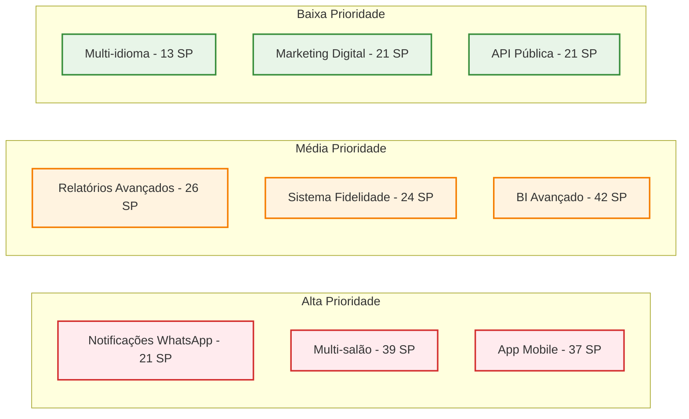

# 📋 LashManager - Product Backlog Detalhado

Product Backlog organizado por épicos e user stories para o sistema LashManager

[🎯 Épicos MVP](#-épicos-mvp-v10) • [🔄 Melhorias v1.1](#-melhorias-v11) • [📈 Expansão v1.2](#-expansão-v12) • [🏢 Enterprise v2.0](#-enterprise-v20)

---

## 🎯 Épicos MVP (v1.0) - CONCLUÍDO

### 👥 ÉPICO 1: Gestão de Clientes
**Valor de Negócio**: Controle completo da base de clientes
**Story Points Total**: 14

#### US001 - Cadastrar Cliente
**Como** recepcionista  
**Eu quero** cadastrar um novo cliente no sistema  
**Para que** eu possa registrar suas informações básicas e histórico

**Critérios de Aceitação:**
- [ ] Campos obrigatórios: nome, telefone
- [ ] Validação de formato de telefone brasileiro (XX) XXXXX-XXXX
- [ ] Email opcional com validação de formato
- [ ] Campo observações para alergias/preferências
- [ ] Verificação de duplicatas por telefone
- [ ] Mensagem de sucesso após cadastro

**Story Points**: 5 | **Prioridade**: Alta | **Status**: ✅ Done

#### US002 - Buscar Cliente
**Como** recepcionista  
**Eu quero** buscar clientes por nome ou telefone  
**Para que** eu possa encontrar rapidamente um cliente existente

**Critérios de Aceitação:**
- [ ] Busca em tempo real (mínimo 2 caracteres)
- [ ] Busca por nome (parcial, case-insensitive)
- [ ] Busca por telefone (parcial)
- [ ] Exibir resultados em lista
- [ ] Máximo 10 resultados por busca
- [ ] Indicar quando não há resultados

**Story Points**: 3 | **Prioridade**: Alta | **Status**: ✅ Done

#### US003 - Visualizar Histórico do Cliente
**Como** funcionário  
**Eu quero** ver o histórico completo do cliente  
**Para que** eu possa conhecer suas preferências e alergias

**Critérios de Aceitação:**
- [ ] Listar todos os agendamentos anteriores
- [ ] Mostrar procedimentos realizados
- [ ] Exibir valores pagos e pendentes
- [ ] Mostrar observações de cada atendimento
- [ ] Ordenar por data (mais recente primeiro)
- [ ] Indicar status de cada agendamento

**Story Points**: 3 | **Prioridade**: Média | **Status**: ✅ Done

#### US004 - Editar Dados do Cliente
**Como** admin  
**Eu quero** editar informações do cliente  
**Para que** eu possa manter os dados atualizados

**Critérios de Aceitação:**
- [ ] Todos os campos editáveis exceto ID
- [ ] Validações iguais ao cadastro
- [ ] Confirmação antes de salvar
- [ ] Log de alterações (quem/quando)
- [ ] Mensagem de sucesso
- [ ] Não permitir telefone duplicado

**Story Points**: 2 | **Prioridade**: Média | **Status**: ✅ Done

#### US005 - Desativar Cliente
**Como** admin  
**Eu quero** desativar um cliente  
**Para que** eu possa remover clientes inativos sem perder histórico

**Critérios de Aceitação:**
- [ ] Soft delete (marcar como inativo)
- [ ] Confirmação obrigatória
- [ ] Não aparecer em buscas normais
- [ ] Manter histórico de agendamentos
- [ ] Possibilidade de reativar
- [ ] Log da ação

**Story Points**: 1 | **Prioridade**: Baixa | **Status**: ✅ Done

---

### 📅 ÉPICO 2: Sistema de Agenda
**Valor de Negócio**: Controle eficiente de horários e agendamentos
**Story Points Total**: 26

#### US006 - Criar Agendamento
**Como** recepcionista  
**Eu quero** criar um novo agendamento  
**Para que** eu possa marcar procedimento para o cliente

**Critérios de Aceitação:**
- [ ] Selecionar cliente (busca ou novo)
- [ ] Escolher funcionário disponível
- [ ] Selecionar procedimento
- [ ] Definir data e horário
- [ ] Validar conflitos de horário
- [ ] Calcular duração automaticamente
- [ ] Salvar com status "agendado"

**Story Points**: 8 | **Prioridade**: Alta | **Status**: ✅ Done

#### US007 - Visualizar Agenda do Funcionário
**Como** funcionário  
**Eu quero** ver minha agenda do dia  
**Para que** eu possa saber meus próximos atendimentos

**Critérios de Aceitação:**
- [ ] Mostrar agenda do dia atual
- [ ] Listar horários ocupados e livres
- [ ] Exibir dados do cliente e procedimento
- [ ] Indicar status de cada agendamento
- [ ] Permitir navegação entre dias
- [ ] Atualizar em tempo real

**Story Points**: 5 | **Prioridade**: Alta | **Status**: ✅ Done

#### US008 - Reagendar Compromisso
**Como** recepcionista  
**Eu quero** alterar data/horário de um agendamento  
**Para que** eu possa atender solicitações de mudança

**Critérios de Aceitação:**
- [ ] Buscar agendamento existente
- [ ] Mostrar dados atuais
- [ ] Permitir alterar data/horário
- [ ] Validar nova disponibilidade
- [ ] Confirmar alteração
- [ ] Notificar cliente (futuro)

**Story Points**: 5 | **Prioridade**: Alta | **Status**: ✅ Done

#### US009 - Visualizar Agenda Geral
**Como** admin  
**Eu quero** ver agenda de todos os funcionários  
**Para que** eu possa controlar a ocupação do salão

**Critérios de Aceitação:**
- [ ] Visão consolidada por dia
- [ ] Filtrar por funcionário
- [ ] Mostrar taxa de ocupação
- [ ] Identificar horários livres
- [ ] Exportar agenda (futuro)
- [ ] Cores diferentes por status

**Story Points**: 3 | **Prioridade**: Média | **Status**: ✅ Done

#### US010 - Alterar Status do Agendamento
**Como** funcionário  
**Eu quero** marcar o status do agendamento  
**Para que** eu possa controlar o fluxo do atendimento

**Critérios de Aceitação:**
- [ ] Status: agendado → confirmado → em_andamento → concluído
- [ ] Permitir cancelamento a qualquer momento
- [ ] Marcar "não compareceu" se necessário
- [ ] Log de mudanças de status
- [ ] Timestamp automático
- [ ] Validar transições válidas

**Story Points**: 3 | **Prioridade**: Média | **Status**: ✅ Done

#### US011 - Cancelar Agendamento
**Como** recepcionista  
**Eu quero** cancelar um agendamento  
**Para que** eu possa liberar o horário quando cliente desiste

**Critérios de Aceitação:**
- [ ] Buscar agendamento por ID ou cliente
- [ ] Mostrar dados do agendamento
- [ ] Solicitar motivo do cancelamento
- [ ] Confirmar cancelamento
- [ ] Liberar horário automaticamente
- [ ] Manter histórico

**Story Points**: 2 | **Prioridade**: Média | **Status**: ✅ Done

---

### 💰 ÉPICO 3: Controle Financeiro
**Valor de Negócio**: Gestão completa de receitas e pagamentos
**Story Points Total**: 19

#### US012 - Registrar Pagamento
**Como** recepcionista  
**Eu quero** registrar um pagamento recebido  
**Para que** eu possa controlar os valores recebidos

**Critérios de Aceitação:**
- [ ] Associar pagamento a agendamento
- [ ] Formas: dinheiro, PIX, débito, crédito, transferência
- [ ] Valor padrão do procedimento (editável)
- [ ] Data/hora automática
- [ ] Campo observações opcional
- [ ] Calcular troco se dinheiro

**Story Points**: 5 | **Prioridade**: Alta | **Status**: ✅ Done

#### US013 - Visualizar Receita Diária
**Como** admin  
**Eu quero** ver a receita do dia  
**Para que** eu possa acompanhar a performance financeira

**Critérios de Aceitação:**
- [ ] Total recebido no dia
- [ ] Breakdown por forma de pagamento
- [ ] Número de atendimentos
- [ ] Ticket médio
- [ ] Comparação com dia anterior
- [ ] Meta diária (se configurada)

**Story Points**: 3 | **Prioridade**: Alta | **Status**: ✅ Done

#### US014 - Gerar Relatório Mensal
**Como** admin  
**Eu quero** gerar relatório financeiro mensal  
**Para que** eu possa fazer análise financeira detalhada

**Critérios de Aceitação:**
- [ ] Receita total do mês
- [ ] Receita por funcionário
- [ ] Receita por procedimento
- [ ] Formas de pagamento utilizadas
- [ ] Comparação com mês anterior
- [ ] Gráficos visuais

**Story Points**: 5 | **Prioridade**: Média | **Status**: ✅ Done

#### US015 - Visualizar Comissões
**Como** funcionário  
**Eu quero** ver meus ganhos e comissões  
**Para que** eu possa acompanhar minha remuneração

**Critérios de Aceitação:**
- [ ] Total de procedimentos realizados
- [ ] Valor total gerado
- [ ] Percentual de comissão configurado
- [ ] Valor da comissão calculado
- [ ] Período selecionável
- [ ] Detalhamento por procedimento

**Story Points**: 3 | **Prioridade**: Média | **Status**: ✅ Done

#### US016 - Controlar Pendências
**Como** admin  
**Eu quero** ver pagamentos pendentes  
**Para que** eu possa identificar valores em atraso

**Critérios de Aceitação:**
- [ ] Listar agendamentos sem pagamento
- [ ] Mostrar valor devido
- [ ] Dias em atraso
- [ ] Dados do cliente
- [ ] Ações de cobrança
- [ ] Marcar como pago quando receber

**Story Points**: 3 | **Prioridade**: Média | **Status**: ✅ Done

---

### 👩💼 ÉPICO 4: Gestão de Funcionários
**Valor de Negócio**: Controle de equipe e especialidades
**Story Points Total**: 15

#### US017 - Cadastrar Funcionário
**Como** admin  
**Eu quero** cadastrar um funcionário  
**Para que** eu possa registrar os especialistas do salão

**Critérios de Aceitação:**
- [ ] Nome completo obrigatório
- [ ] Especialidade principal
- [ ] Telefone e email
- [ ] Percentual de comissão
- [ ] Status ativo/inativo
- [ ] Data de cadastro automática

**Story Points**: 3 | **Prioridade**: Alta | **Status**: ✅ Done

#### US018 - Definir Especialidades
**Como** admin  
**Eu quero** associar procedimentos ao funcionário  
**Para que** eu possa definir quem pode fazer cada procedimento

**Critérios de Aceitação:**
- [ ] Lista de procedimentos disponíveis
- [ ] Marcar/desmarcar procedimentos
- [ ] Funcionário pode ter múltiplas especialidades
- [ ] Validar ao criar agendamento
- [ ] Histórico de alterações
- [ ] Salvar automaticamente

**Story Points**: 2 | **Prioridade**: Alta | **Status**: ✅ Done

#### US019 - Configurar Horários de Trabalho
**Como** admin  
**Eu quero** definir horários de trabalho do funcionário  
**Para que** eu possa controlar sua disponibilidade

**Critérios de Aceitação:**
- [ ] Horário por dia da semana
- [ ] Horário de início e fim
- [ ] Dias de folga
- [ ] Intervalos (almoço, etc.)
- [ ] Horários especiais/feriados
- [ ] Validar agendamentos dentro do horário

**Story Points**: 3 | **Prioridade**: Média | **Status**: ✅ Done

#### US020 - Visualizar Performance
**Como** admin  
**Eu quero** ver performance do funcionário  
**Para que** eu possa avaliar produtividade

**Critérios de Aceitação:**
- [ ] Número de atendimentos
- [ ] Receita gerada
- [ ] Taxa de ocupação
- [ ] Avaliação média (futuro)
- [ ] Comparação entre funcionários
- [ ] Período selecionável

**Story Points**: 5 | **Prioridade**: Média | **Status**: ✅ Done

#### US021 - Acessar Perfil Próprio
**Como** funcionário  
**Eu quero** acessar meu perfil  
**Para que** eu possa ver minhas informações e agenda

**Critérios de Aceitação:**
- [ ] Dados pessoais (somente leitura)
- [ ] Minha agenda
- [ ] Meus procedimentos
- [ ] Minhas comissões
- [ ] Alterar senha
- [ ] Histórico de atendimentos

**Story Points**: 2 | **Prioridade**: Baixa | **Status**: ✅ Done

---

## 🔄 Melhorias v1.1 (Q4 2025)

### 📱 ÉPICO 5: Notificações WhatsApp
**Valor de Negócio**: Comunicação automática com clientes
**Story Points Total**: 21

#### US022 - Confirmação de Agendamento
**Como** cliente  
**Eu quero** receber confirmação por WhatsApp  
**Para que** eu tenha certeza do meu agendamento

**Critérios de Aceitação:**
- [ ] Envio automático após criar agendamento
- [ ] Template configurável
- [ ] Dados: data, hora, procedimento, funcionário
- [ ] Link para cancelar/reagendar (futuro)
- [ ] Log de envio
- [ ] Fallback para SMS se WhatsApp falhar

**Story Points**: 8 | **Prioridade**: Alta | **Status**: 🔄 In Progress

#### US023 - Lembrete 24h Antes
**Como** cliente  
**Eu quero** receber lembrete 24h antes  
**Para que** eu não esqueça do meu compromisso

**Critérios de Aceitação:**
- [ ] Job automático executado diariamente
- [ ] Buscar agendamentos do dia seguinte
- [ ] Enviar apenas para status "agendado" ou "confirmado"
- [ ] Template personalizável
- [ ] Permitir resposta de confirmação
- [ ] Marcar como "confirmado" se cliente responder

**Story Points**: 5 | **Prioridade**: Alta | **Status**: 📋 To Do

#### US024 - Lembrete 2h Antes
**Como** cliente  
**Eu quero** receber lembrete 2h antes  
**Para que** eu possa me preparar e confirmar presença

**Critérios de Aceitação:**
- [ ] Job executado a cada hora
- [ ] Buscar agendamentos das próximas 2h
- [ ] Enviar apenas se não foi enviado antes
- [ ] Template diferente do lembrete 24h
- [ ] Incluir endereço do salão
- [ ] Opção de cancelamento de última hora

**Story Points**: 3 | **Prioridade**: Média | **Status**: 📋 To Do

#### US025 - Configurar Templates
**Como** admin  
**Eu quero** configurar templates de mensagem  
**Para que** eu possa personalizar a comunicação

**Critérios de Aceitação:**
- [ ] Templates para cada tipo de notificação
- [ ] Variáveis dinâmicas (nome, data, hora, etc.)
- [ ] Preview da mensagem
- [ ] Salvar múltiplas versões
- [ ] Ativar/desativar templates
- [ ] Validar variáveis obrigatórias

**Story Points**: 3 | **Prioridade**: Média | **Status**: 📋 To Do

#### US026 - Enviar Mensagem Manual
**Como** recepcionista  
**Eu quero** enviar mensagem personalizada  
**Para que** eu possa fazer comunicação específica

**Critérios de Aceitação:**
- [ ] Selecionar cliente da lista
- [ ] Escrever mensagem livre
- [ ] Usar templates como base
- [ ] Visualizar histórico de mensagens
- [ ] Confirmar antes de enviar
- [ ] Status de entrega

**Story Points**: 2 | **Prioridade**: Baixa | **Status**: 📋 To Do

---

### 📊 ÉPICO 6: Relatórios Avançados
**Valor de Negócio**: Business Intelligence para tomada de decisão
**Story Points Total**: 26

#### US027 - Exportar Relatórios PDF
**Como** admin  
**Eu quero** exportar relatórios em PDF  
**Para que** eu possa compartilhar com contador

**Critérios de Aceitação:**
- [ ] Relatórios financeiros em PDF
- [ ] Logo e dados do salão
- [ ] Gráficos e tabelas
- [ ] Período selecionável
- [ ] Download automático
- [ ] Envio por email (futuro)

**Story Points**: 5 | **Prioridade**: Alta | **Status**: 📋 To Do

#### US028 - Análise de Clientes
**Como** admin  
**Eu quero** ver análise detalhada de clientes  
**Para que** eu possa identificar padrões de comportamento

**Critérios de Aceitação:**
- [ ] Clientes mais frequentes
- [ ] Clientes que gastam mais
- [ ] Tempo médio entre visitas
- [ ] Procedimentos preferidos por cliente
- [ ] Clientes inativos (sem agendamento há X dias)
- [ ] Segmentação por valor gasto

**Story Points**: 8 | **Prioridade**: Média | **Status**: 📋 To Do

#### US029 - Comparação Mensal
**Como** admin  
**Eu quero** comparar performance entre meses  
**Para que** eu possa acompanhar evolução do negócio

**Critérios de Aceitação:**
- [ ] Gráfico de receita por mês
- [ ] Número de clientes atendidos
- [ ] Crescimento percentual
- [ ] Sazonalidade identificada
- [ ] Metas vs realizado
- [ ] Projeções futuras (básicas)

**Story Points**: 5 | **Prioridade**: Média | **Status**: 📋 To Do

#### US030 - Procedimentos Populares
**Como** admin  
**Eu quero** ver quais procedimentos são mais populares  
**Para que** eu possa otimizar a oferta de serviços

**Critérios de Aceitação:**
- [ ] Ranking de procedimentos por quantidade
- [ ] Ranking por receita gerada
- [ ] Tendências ao longo do tempo
- [ ] Margem de lucro por procedimento
- [ ] Tempo médio de execução
- [ ] Recomendações de preço

**Story Points**: 3 | **Prioridade**: Média | **Status**: 📋 To Do

#### US031 - Análise de Horários
**Como** admin  
**Eu quero** analisar horários de pico  
**Para que** eu possa otimizar a escala de funcionários

**Critérios de Aceitação:**
- [ ] Heatmap de ocupação por horário
- [ ] Dias da semana mais movimentados
- [ ] Horários com maior demanda
- [ ] Taxa de ocupação por funcionário
- [ ] Sugestões de otimização
- [ ] Identificar horários ociosos

**Story Points**: 5 | **Prioridade**: Baixa | **Status**: 📋 To Do

---

### 💾 ÉPICO 7: Backup Automático
**Valor de Negócio**: Segurança e recuperação de dados
**Story Points Total**: 18

#### US032 - Backup Diário Automático
**Como** admin  
**Eu quero** backup automático diário  
**Para que** eu possa proteger os dados contra perda

**Critérios de Aceitação:**
- [ ] Job executado diariamente às 2h
- [ ] Backup completo do banco de dados
- [ ] Backup de arquivos de configuração
- [ ] Compressão e criptografia
- [ ] Armazenamento em nuvem
- [ ] Retenção de 30 dias

**Story Points**: 8 | **Prioridade**: Alta | **Status**: 📋 To Do

#### US033 - Restaurar Backup
**Como** admin  
**Eu quero** restaurar um backup  
**Para que** eu possa recuperar dados em caso de problema

**Critérios de Aceitação:**
- [ ] Lista de backups disponíveis
- [ ] Visualizar data e tamanho
- [ ] Confirmar restauração
- [ ] Processo com barra de progresso
- [ ] Validar integridade após restauração
- [ ] Log detalhado da operação

**Story Points**: 5 | **Prioridade**: Alta | **Status**: 📋 To Do

#### US034 - Notificação de Backup
**Como** admin  
**Eu quero** receber notificação sobre backups  
**Para que** eu possa confirmar que os dados estão seguros

**Critérios de Aceitação:**
- [ ] Email de confirmação diário
- [ ] Status: sucesso, falha, warning
- [ ] Tamanho do backup
- [ ] Tempo de execução
- [ ] Alerta se backup falhar
- [ ] Dashboard com status dos últimos backups

**Story Points**: 2 | **Prioridade**: Média | **Status**: 📋 To Do

#### US035 - Configurar Retenção
**Como** admin  
**Eu quero** configurar política de retenção  
**Para que** eu possa controlar o espaço de armazenamento

**Critérios de Aceitação:**
- [ ] Definir quantos dias manter backups
- [ ] Configurar backup semanal/mensal
- [ ] Limpeza automática de backups antigos
- [ ] Alertas de espaço em disco
- [ ] Configurar destino do backup
- [ ] Testar conectividade com destino

**Story Points**: 3 | **Prioridade**: Baixa | **Status**: 📋 To Do

---

### 🌐 ÉPICO 8: Multi-idioma
**Valor de Negócio**: Suporte internacional
**Story Points Total**: 13

#### US036 - Interface Multi-idioma
**Como** usuário  
**Eu quero** alterar o idioma da interface  
**Para que** eu possa usar o sistema em português ou inglês

**Critérios de Aceitação:**
- [ ] Seletor de idioma no header
- [ ] Tradução de todos os textos da interface
- [ ] Persistir escolha do usuário
- [ ] Formatos de data/hora por região
- [ ] Símbolos de moeda corretos
- [ ] Fallback para português se tradução não existir

**Story Points**: 8 | **Prioridade**: Média | **Status**: 📋 To Do

#### US037 - Configurar Idioma Padrão
**Como** admin  
**Eu quero** definir idioma padrão do sistema  
**Para que** eu possa configurar o idioma principal do salão

**Critérios de Aceitação:**
- [ ] Configuração global do sistema
- [ ] Aplicar para novos usuários
- [ ] Não afetar usuários que já escolheram
- [ ] Validar idiomas disponíveis
- [ ] Salvar em configurações do sistema
- [ ] Aplicar imediatamente

**Story Points**: 2 | **Prioridade**: Baixa | **Status**: 📋 To Do

#### US038 - Mensagens Multi-idioma
**Como** cliente  
**Eu quero** receber mensagens no meu idioma  
**Para que** eu possa entender as comunicações

**Critérios de Aceitação:**
- [ ] Detectar idioma preferido do cliente
- [ ] Templates de WhatsApp em múltiplos idiomas
- [ ] Configurar idioma por cliente
- [ ] Fallback para idioma padrão
- [ ] Tradução de nomes de procedimentos
- [ ] Formatos de data/hora localizados

**Story Points**: 3 | **Prioridade**: Baixa | **Status**: 📋 To Do

---

## 📈 Expansão v1.2 (Q1 2026)

### 🎁 ÉPICO 9: Sistema de Fidelidade
**Valor de Negócio**: Retenção e engajamento de clientes
**Story Points Total**: 24

#### US039 - Acumular Pontos
**Como** cliente  
**Eu quero** acumular pontos por procedimento  
**Para que** eu possa ganhar recompensas

**Critérios de Aceitação:**
- [ ] Pontos automáticos após procedimento concluído
- [ ] Regra configurável (R$ 1 = X pontos)
- [ ] Diferentes pontos por tipo de procedimento
- [ ] Histórico de pontos ganhos
- [ ] Saldo atual visível
- [ ] Notificação quando ganhar pontos

**Story Points**: 8 | **Prioridade**: Alta | **Status**: 📋 To Do

#### US040 - Resgatar Pontos
**Como** cliente  
**Eu quero** resgatar pontos por desconto  
**Para que** eu possa economizar em procedimentos

**Critérios de Aceitação:**
- [ ] Converter pontos em desconto
- [ ] Regra configurável de conversão
- [ ] Aplicar desconto no pagamento
- [ ] Validar saldo suficiente
- [ ] Histórico de resgates
- [ ] Não permitir resgate parcial

**Story Points**: 5 | **Prioridade**: Alta | **Status**: 📋 To Do

#### US041 - Configurar Regras
**Como** admin  
**Eu quero** configurar regras de pontuação  
**Para que** eu possa personalizar o programa

**Critérios de Aceitação:**
- [ ] Pontos por real gasto
- [ ] Multiplicadores por procedimento
- [ ] Bônus por frequência
- [ ] Validade dos pontos
- [ ] Mínimo para resgate
- [ ] Campanhas especiais

**Story Points**: 5 | **Prioridade**: Média | **Status**: 📋 To Do

#### US042 - Visualizar Saldo
**Como** cliente  
**Eu quero** ver meu saldo de pontos  
**Para que** eu possa acompanhar minhas recompensas

**Critérios de Aceitação:**
- [ ] Saldo atual destacado
- [ ] Histórico de ganhos e resgates
- [ ] Pontos a expirar
- [ ] Próximas recompensas disponíveis
- [ ] Compartilhar saldo (redes sociais)
- [ ] Notificações de saldo

**Story Points**: 3 | **Prioridade**: Média | **Status**: 📋 To Do

#### US043 - Relatório de Fidelidade
**Como** admin  
**Eu quero** ver relatório do programa de fidelidade  
**Para que** eu possa analisar o engajamento

**Critérios de Aceitação:**
- [ ] Clientes mais engajados
- [ ] Pontos distribuídos vs resgatados
- [ ] ROI do programa
- [ ] Taxa de retenção
- [ ] Procedimentos que mais geram pontos
- [ ] Sugestões de melhorias

**Story Points**: 3 | **Prioridade**: Baixa | **Status**: 📋 To Do

---

### 📧 ÉPICO 10: Marketing Digital
**Valor de Negócio**: Campanhas e comunicação com clientes
**Story Points Total**: 21

#### US044 - Criar Campanha de Email
**Como** admin  
**Eu quero** criar campanhas de email marketing  
**Para que** eu possa promover serviços

**Critérios de Aceitação:**
- [ ] Editor de email visual
- [ ] Templates pré-definidos
- [ ] Inserir imagens e links
- [ ] Personalização com dados do cliente
- [ ] Agendar envio
- [ ] Preview antes de enviar

**Story Points**: 8 | **Prioridade**: Média | **Status**: 📋 To Do

#### US045 - Segmentar Clientes
**Como** admin  
**Eu quero** segmentar clientes para campanhas  
**Para que** eu possa enviar ofertas personalizadas

**Critérios de Aceitação:**
- [ ] Segmentar por frequência de visitas
- [ ] Segmentar por valor gasto
- [ ] Segmentar por procedimento preferido
- [ ] Segmentar por tempo desde última visita
- [ ] Criar segmentos customizados
- [ ] Salvar segmentos para reutilizar

**Story Points**: 5 | **Prioridade**: Média | **Status**: 📋 To Do

#### US046 - Envios Automáticos
**Como** admin  
**Eu quero** agendar envios automáticos  
**Para que** eu possa lembrar clientes de retorno

**Critérios de Aceitação:**
- [ ] Trigger baseado em tempo (30 dias sem visita)
- [ ] Trigger baseado em evento (aniversário)
- [ ] Campanhas de reativação
- [ ] Ofertas especiais automáticas
- [ ] Parar envios se cliente agendar
- [ ] Limite de frequência

**Story Points**: 5 | **Prioridade**: Média | **Status**: 📋 To Do

#### US047 - Métricas de Campanha
**Como** admin  
**Eu quero** ver métricas das campanhas  
**Para que** eu possa avaliar a efetividade

**Critérios de Aceitação:**
- [ ] Taxa de abertura
- [ ] Taxa de clique
- [ ] Conversões (agendamentos)
- [ ] ROI da campanha
- [ ] Descadastros
- [ ] Comparar campanhas

**Story Points**: 3 | **Prioridade**: Baixa | **Status**: 📋 To Do

---

### 📱 ÉPICO 11: App Mobile Nativo
**Valor de Negócio**: Experiência mobile otimizada
**Story Points Total**: 37

#### US048 - Agendamento Mobile
**Como** cliente  
**Eu quero** agendar pelo app  
**Para que** eu tenha conveniência mobile

**Critérios de Aceitação:**
- [ ] Login com telefone/email
- [ ] Selecionar procedimento
- [ ] Escolher funcionário (opcional)
- [ ] Ver horários disponíveis
- [ ] Confirmar agendamento
- [ ] Receber confirmação push

**Story Points**: 13 | **Prioridade**: Alta | **Status**: 📋 To Do

#### US049 - Meus Agendamentos
**Como** cliente  
**Eu quero** ver meus agendamentos no app  
**Para que** eu possa acompanhar meus compromissos

**Critérios de Aceitação:**
- [ ] Lista de próximos agendamentos
- [ ] Histórico de agendamentos
- [ ] Detalhes de cada agendamento
- [ ] Cancelar agendamento
- [ ] Reagendar (se permitido)
- [ ] Avaliar atendimento após conclusão

**Story Points**: 8 | **Prioridade**: Alta | **Status**: 📋 To Do

#### US050 - Notificações Push
**Como** cliente  
**Eu quero** receber notificações push  
**Para que** eu tenha lembretes no celular

**Critérios de Aceitação:**
- [ ] Confirmação de agendamento
- [ ] Lembrete 24h antes
- [ ] Lembrete 2h antes
- [ ] Ofertas especiais
- [ ] Configurar tipos de notificação
- [ ] Horário de silêncio

**Story Points**: 5 | **Prioridade**: Média | **Status**: 📋 To Do

#### US051 - App para Funcionários
**Como** funcionário  
**Eu quero** acessar minha agenda no app  
**Para que** eu possa trabalhar em movimento

**Critérios de Aceitação:**
- [ ] Login com credenciais do sistema
- [ ] Ver agenda do dia
- [ ] Marcar início/fim de procedimento
- [ ] Ver dados do cliente
- [ ] Registrar observações
- [ ] Tirar fotos antes/depois

**Story Points**: 8 | **Prioridade**: Média | **Status**: 📋 To Do

#### US052 - Avaliação de Atendimento
**Como** cliente  
**Eu quero** avaliar o atendimento  
**Para que** eu possa dar feedback

**Critérios de Aceitação:**
- [ ] Avaliação de 1 a 5 estrelas
- [ ] Comentário opcional
- [ ] Avaliar funcionário específico
- [ ] Avaliar procedimento
- [ ] Enviar após procedimento concluído
- [ ] Histórico de avaliações

**Story Points**: 3 | **Prioridade**: Baixa | **Status**: 📋 To Do

---

### 📲 ÉPICO 12: Integração Redes Sociais
**Valor de Negócio**: Marketing e presença digital
**Story Points Total**: 26

#### US053 - Publicação Automática
**Como** admin  
**Eu quero** publicar fotos automaticamente  
**Para que** eu possa divulgar os trabalhos

**Critérios de Aceitação:**
- [ ] Conectar com Instagram Business
- [ ] Conectar com Facebook Page
- [ ] Publicar fotos "depois" automaticamente
- [ ] Hashtags automáticas
- [ ] Texto personalizado por procedimento
- [ ] Agendar publicações

**Story Points**: 8 | **Prioridade**: Média | **Status**: 📋 To Do

#### US054 - Agendamento via Instagram
**Como** cliente  
**Eu quero** agendar via Instagram  
**Para que** eu possa marcar facilmente

**Critérios de Aceitação:**
- [ ] Bot no Instagram Direct
- [ ] Comandos simples (agendar, horários)
- [ ] Integração com sistema de agenda
- [ ] Confirmação via DM
- [ ] Redirecionamento para app se necessário
- [ ] Suporte a stories com link

**Story Points**: 8 | **Prioridade**: Média | **Status**: 📋 To Do

#### US055 - Importar Avaliações
**Como** admin  
**Eu quero** importar avaliações do Google/Facebook  
**Para que** eu possa mostrar credibilidade

**Critérios de Aceitação:**
- [ ] Conectar com Google My Business
- [ ] Conectar com Facebook Reviews
- [ ] Sincronizar avaliações automaticamente
- [ ] Exibir no site/app
- [ ] Responder avaliações pelo sistema
- [ ] Alertas para novas avaliações

**Story Points**: 5 | **Prioridade**: Baixa | **Status**: 📋 To Do

#### US056 - Sincronizar Eventos
**Como** admin  
**Eu quero** sincronizar eventos com redes sociais  
**Para que** eu possa manter calendários atualizados

**Critérios de Aceitação:**
- [ ] Criar eventos no Facebook
- [ ] Publicar promoções especiais
- [ ] Sincronizar horários especiais
- [ ] Divulgar workshops/cursos
- [ ] Integrar com Google Calendar
- [ ] Notificar seguidores

**Story Points**: 5 | **Prioridade**: Baixa | **Status**: 📋 To Do

---

## 🏢 Enterprise v2.0 (Q2 2026)

### 🏪 ÉPICO 13: Multi-salão
**Valor de Negócio**: Escalabilidade para múltiplas unidades
**Story Points Total**: 39

#### US057 - Cadastrar Múltiplos Salões
**Como** admin master  
**Eu quero** cadastrar múltiplos salões  
**Para que** eu possa gerenciar uma rede

**Critérios de Aceitação:**
- [ ] Cadastro de unidades/filiais
- [ ] Endereço e dados específicos
- [ ] Configurações independentes
- [ ] Funcionários por unidade
- [ ] Procedimentos por unidade
- [ ] Hierarquia de permissões

**Story Points**: 13 | **Prioridade**: Alta | **Status**: 📋 To Do

#### US058 - Dashboard Consolidado
**Como** admin master  
**Eu quero** ver dashboard consolidado  
**Para que** eu possa ter visão geral do negócio

**Critérios de Aceitação:**
- [ ] Métricas consolidadas de todas unidades
- [ ] Comparação entre unidades
- [ ] Ranking de performance
- [ ] Filtros por unidade
- [ ] Drill-down para detalhes
- [ ] Exportação de relatórios

**Story Points**: 8 | **Prioridade**: Alta | **Status**: 📋 To Do

#### US059 - Gestão Local
**Como** admin local  
**Eu quero** gerenciar apenas meu salão  
**Para que** eu tenha autonomia operacional

**Critérios de Aceitação:**
- [ ] Acesso restrito à própria unidade
- [ ] Todas funcionalidades do sistema base
- [ ] Relatórios locais
- [ ] Configurações específicas
- [ ] Não ver dados de outras unidades
- [ ] Escalação para admin master se necessário

**Story Points**: 5 | **Prioridade**: Média | **Status**: 📋 To Do

#### US060 - Agendamento Multi-unidade
**Como** cliente  
**Eu quero** agendar em qualquer unidade  
**Para que** eu tenha flexibilidade de escolha

**Critérios de Aceitação:**
- [ ] Selecionar unidade preferida
- [ ] Ver disponibilidade em todas unidades
- [ ] Histórico unificado
- [ ] Pontos de fidelidade compartilhados
- [ ] Preferências mantidas
- [ ] Notificações da unidade escolhida

**Story Points**: 8 | **Prioridade**: Média | **Status**: 📋 To Do

#### US061 - Transferir Funcionários
**Como** admin master  
**Eu quero** transferir funcionários entre unidades  
**Para que** eu possa otimizar recursos

**Critérios de Aceitação:**
- [ ] Mover funcionário entre unidades
- [ ] Manter histórico de performance
- [ ] Transferir agendamentos futuros
- [ ] Notificar clientes afetados
- [ ] Ajustar permissões automaticamente
- [ ] Log de transferências

**Story Points**: 5 | **Prioridade**: Baixa | **Status**: 📋 To Do

---

### 🤝 ÉPICO 14: Sistema de Franquia
**Valor de Negócio**: Modelo de negócio escalável
**Story Points Total**: 26

#### US062 - Controlar Royalties
**Como** franqueador  
**Eu quero** controlar royalties das franquias  
**Para que** eu possa receber os pagamentos devidos

**Critérios de Aceitação:**
- [ ] Calcular royalties automaticamente
- [ ] Percentual configurável por franquia
- [ ] Relatório mensal de royalties
- [ ] Status de pagamento
- [ ] Histórico de pagamentos
- [ ] Alertas de atraso

**Story Points**: 8 | **Prioridade**: Alta | **Status**: 📋 To Do

#### US063 - Performance das Franquias
**Como** franqueador  
**Eu quero** ver performance das franquias  
**Para que** eu possa apoiar os franqueados

**Critérios de Aceitação:**
- [ ] Ranking de performance
- [ ] Métricas padronizadas
- [ ] Comparação com metas
- [ ] Identificar franquias em dificuldade
- [ ] Benchmarking entre franquias
- [ ] Relatórios executivos

**Story Points**: 8 | **Prioridade**: Alta | **Status**: 📋 To Do

#### US064 - Relatórios Padrão
**Como** franqueado  
**Eu quero** acessar relatórios padrão da rede  
**Para que** eu possa seguir a metodologia

**Critérios de Aceitação:**
- [ ] Templates de relatórios obrigatórios
- [ ] Métricas padronizadas
- [ ] Comparação com outras franquias
- [ ] Metas estabelecidas pela rede
- [ ] Planos de ação sugeridos
- [ ] Acesso a melhores práticas

**Story Points**: 5 | **Prioridade**: Média | **Status**: 📋 To Do

#### US065 - Padrões Obrigatórios
**Como** franqueador  
**Eu quero** definir padrões obrigatórios  
**Para que** eu possa manter a qualidade da marca

**Critérios de Aceitação:**
- [ ] Procedimentos padronizados
- [ ] Preços mínimos/máximos
- [ ] Configurações obrigatórias
- [ ] Validação de conformidade
- [ ] Alertas de não conformidade
- [ ] Auditoria automática

**Story Points**: 5 | **Prioridade**: Média | **Status**: 📋 To Do

---

### 📊 ÉPICO 15: BI Avançado
**Valor de Negócio**: Inteligência de negócio com IA
**Story Points Total**: 42

#### US066 - Previsão de Demanda
**Como** admin  
**Eu quero** previsão de demanda com IA  
**Para que** eu possa planejar recursos

**Critérios de Aceitação:**
- [ ] Algoritmo de machine learning
- [ ] Previsão por dia da semana
- [ ] Previsão por procedimento
- [ ] Considerar sazonalidade
- [ ] Considerar feriados e eventos
- [ ] Acurácia mínima de 80%

**Story Points**: 13 | **Prioridade**: Alta | **Status**: 📋 To Do

#### US067 - Análise Preditiva de Clientes
**Como** admin  
**Eu quero** análise preditiva de clientes  
**Para que** eu possa identificar riscos de churn

**Critérios de Aceitação:**
- [ ] Score de propensão ao churn
- [ ] Identificar padrões de comportamento
- [ ] Sugerir ações de retenção
- [ ] Segmentar clientes por risco
- [ ] Campanhas automáticas de retenção
- [ ] Monitorar efetividade das ações

**Story Points**: 13 | **Prioridade**: Média | **Status**: 📋 To Do

#### US068 - Recomendações Automáticas
**Como** admin  
**Eu quero** recomendações automáticas do sistema  
**Para que** eu possa otimizar a operação

**Critérios de Aceitação:**
- [ ] Sugerir horários ótimos para funcionários
- [ ] Recomendar preços dinâmicos
- [ ] Identificar oportunidades de upsell
- [ ] Otimizar agenda automaticamente
- [ ] Sugerir novos procedimentos
- [ ] Alertas de oportunidades perdidas

**Story Points**: 8 | **Prioridade**: Média | **Status**: 📋 To Do

#### US069 - Dashboard Executivo
**Como** admin  
**Eu quero** dashboard executivo avançado  
**Para que** eu possa ter visão estratégica

**Critérios de Aceitação:**
- [ ] KPIs estratégicos
- [ ] Tendências e projeções
- [ ] Análise de cenários
- [ ] Comparação com mercado
- [ ] Alertas estratégicos
- [ ] Relatórios para investidores

**Story Points**: 8 | **Prioridade**: Baixa | **Status**: 📋 To Do

---

### 🔌 ÉPICO 16: API Pública
**Valor de Negócio**: Ecossistema de integrações
**Story Points Total**: 21

#### US070 - API Documentada
**Como** desenvolvedor  
**Eu quero** acessar API bem documentada  
**Para que** eu possa criar integrações

**Critérios de Aceitação:**
- [ ] Documentação OpenAPI/Swagger
- [ ] Exemplos de código
- [ ] SDKs em múltiplas linguagens
- [ ] Sandbox para testes
- [ ] Versionamento da API
- [ ] Changelog detalhado

**Story Points**: 8 | **Prioridade**: Média | **Status**: 📋 To Do

#### US071 - Controle de Acesso API
**Como** admin  
**Eu quero** controlar acesso à API  
**Para que** eu possa manter segurança dos dados

**Critérios de Aceitação:**
- [ ] Sistema de API keys
- [ ] Rate limiting por cliente
- [ ] Logs de acesso detalhados
- [ ] Permissões granulares
- [ ] Revogação de acesso
- [ ] Monitoramento de uso

**Story Points**: 5 | **Prioridade**: Média | **Status**: 📋 To Do

#### US072 - Integrações Parceiros
**Como** parceiro  
**Eu quero** integrar com meu sistema  
**Para que** eu possa sincronizar dados

**Critérios de Aceitação:**
- [ ] Webhooks para eventos importantes
- [ ] Sincronização bidirecional
- [ ] Mapeamento de campos customizável
- [ ] Tratamento de conflitos
- [ ] Logs de sincronização
- [ ] Suporte técnico dedicado

**Story Points**: 8 | **Prioridade**: Baixa | **Status**: 📋 To Do

---

## 📊 Resumo Executivo

### 📈 Métricas Totais do Backlog

| Versão | Épicos | User Stories | Story Points | Status |
|--------|--------|--------------|--------------|--------|
| **v1.0 MVP** | 4 | 21 | 74 | ✅ Concluído |
| **v1.1 Melhorias** | 4 | 17 | 78 | 🔄 Em Progresso |
| **v1.2 Expansão** | 4 | 18 | 108 | 📋 Planejado |
| **v2.0 Enterprise** | 4 | 16 | 128 | 📋 Planejado |
| **TOTAL** | **16** | **72** | **388** | - |

### 🎯 Priorização por Valor de Negócio

### 🚀 Timeline de Entrega

- **Q3 2025**: ✅ MVP v1.0 concluído (74 SP)
- **Q4 2025**: 🔄 v1.1 Melhorias (78 SP)
- **Q1 2026**: 📋 v1.2 Expansão (108 SP)
- **Q2 2026**: 📋 v2.0 Enterprise (128 SP)

---

**Desenvolvido com 💜 por Lila Rodrigues**

*Product Backlog detalhado do LashManager - 72 User Stories organizadas em 16 Épicos*

**Última atualização**: 29/09/2025
**Próxima revisão**: Dezembro 2025

---

### 📋 BACKLOG COMPLETO! 72 USER STORIES! 388 STORY POINTS! 🚀

*Para sugestões de funcionalidades, contate: product@lashmanager.com*

