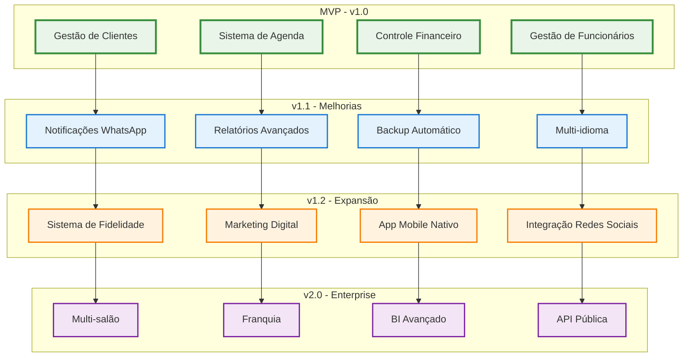
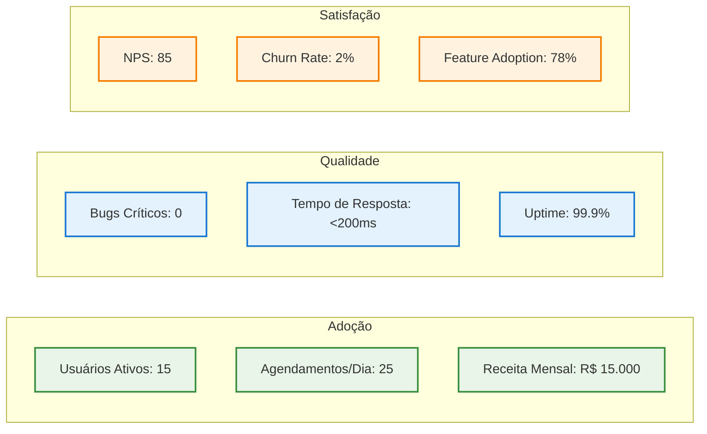
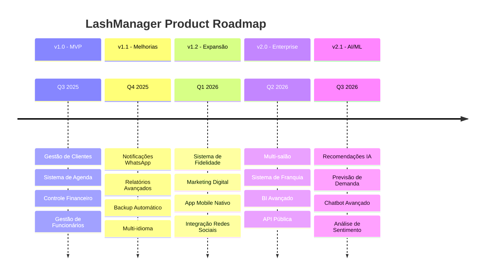

# 📋 LashManager - Product Backlog

Product Backlog completo do sistema de gestão para salões de lash designer

[🎯 Épicos](#-épicos) • [📊 Sprint Planning](#-sprint-planning) • [🚀 Roadmap](#-roadmap) • [📈 Métricas](#-métricas)

---

## 🎯 Épicos e User Stories

### 📊 Visão Geral dos Épicos

---

## 🚀 MVP - v1.0 (CONCLUÍDO)

### 👥 Épico: Gestão de Clientes
**Objetivo**: Sistema completo de cadastro e gestão de clientes

#### User Stories

| ID | Como | Eu quero | Para que | Prioridade | Story Points | Status |
|----|------|----------|----------|------------|--------------|--------|
| **US001** | Recepcionista | Cadastrar novo cliente | Registrar informações básicas | Alta | 5 | ✅ Done |
| **US002** | Recepcionista | Buscar cliente por nome/telefone | Encontrar rapidamente | Alta | 3 | ✅ Done |
| **US003** | Funcionário | Ver histórico do cliente | Conhecer preferências e alergias | Média | 3 | ✅ Done |
| **US004** | Admin | Editar dados do cliente | Manter informações atualizadas | Média | 2 | ✅ Done |
| **US005** | Admin | Desativar cliente | Remover clientes inativos | Baixa | 1 | ✅ Done |

**Critérios de Aceitação:**
- ✅ Campos obrigatórios: nome, telefone
- ✅ Validação de formato de telefone brasileiro
- ✅ Busca em tempo real por nome/telefone
- ✅ Histórico de agendamentos e pagamentos
- ✅ Soft delete (desativação)

### 📅 Épico: Sistema de Agenda
**Objetivo**: Controle completo de agendamentos e horários

#### User Stories

| ID | Como | Eu quero | Para que | Prioridade | Story Points | Status |
|----|------|----------|----------|------------|--------------|--------|
| **US006** | Recepcionista | Criar novo agendamento | Marcar procedimento para cliente | Alta | 8 | ✅ Done |
| **US007** | Funcionário | Ver minha agenda do dia | Saber próximos atendimentos | Alta | 5 | ✅ Done (20/10/2025) |
| **US008** | Recepcionista | Reagendar compromisso | Alterar horário quando necessário | Alta | 5 | ✅ Done (20/10/2025) |
| **US009** | Admin | Ver agenda de todos funcionários | Controlar ocupação do salão | Média | 3 | ✅ Done |
| **US010** | Funcionário | Marcar status do agendamento | Controlar fluxo do atendimento | Média | 3 | ✅ Done |
| **US011** | Recepcionista | Cancelar agendamento | Liberar horário quando cliente desiste | Média | 2 | ✅ Done |

**Critérios de Aceitação:**
- ✅ Validação de conflitos de horário
- ✅ Status: agendado, confirmado, em andamento, concluído, cancelado
- ✅ Visualização por dia/semana/mês
- ✅ Horários de funcionamento configuráveis
- ✅ Duração automática por procedimento

### 💰 Épico: Controle Financeiro
**Objetivo**: Gestão completa de pagamentos e receitas

#### User Stories

| ID | Como | Eu quero | Para que | Prioridade | Story Points | Status |
|----|------|----------|----------|------------|--------------|--------|
| **US012** | Recepcionista | Registrar pagamento | Controlar valores recebidos | Alta | 5 | ✅ Done |
| **US013** | Admin | Ver receita diária | Acompanhar performance financeira | Alta | 3 | ✅ Done |
| **US014** | Admin | Gerar relatório mensal | Análise financeira detalhada | Média | 5 | ✅ Done |
| **US015** | Funcionário | Ver meus ganhos | Acompanhar comissões | Média | 3 | ✅ Done |
| **US016** | Admin | Controlar pendências | Identificar pagamentos em atraso | Média | 3 | ✅ Done |

**Critérios de Aceitação:**
- ✅ Formas de pagamento: dinheiro, PIX, cartão
- ✅ Dashboard com métricas principais
- ✅ Relatórios por período
- ✅ Cálculo automático de comissões
- ✅ Controle de pendências

### 👩💼 Épico: Gestão de Funcionários
**Objetivo**: Cadastro e controle de funcionários especialistas

#### User Stories

| ID | Como | Eu quero | Para que | Prioridade | Story Points | Status |
|----|------|----------|----------|------------|--------------|--------|
| **US017** | Admin | Cadastrar funcionário | Registrar especialistas do salão | Alta | 3 | ✅ Done |
| **US018** | Admin | Definir especialidades | Associar procedimentos por funcionário | Alta | 2 | ✅ Done |
| **US019** | Admin | Configurar horários de trabalho | Controlar disponibilidade | Média | 3 | ✅ Done |
| **US020** | Admin | Ver performance do funcionário | Avaliar produtividade | Média | 5 | ✅ Done |
| **US021** | Funcionário | Acessar meu perfil | Ver minhas informações e agenda | Baixa | 2 | ✅ Done |

**Critérios de Aceitação:**
- ✅ 3 funcionários especialistas
- ✅ Horários de trabalho configuráveis
- ✅ Associação com procedimentos
- ✅ Métricas de performance
- ✅ Perfil individual

---

## 🔄 v1.1 - Melhorias Imediatas (Q4 2025)

### 📱 Épico: Notificações WhatsApp
**Objetivo**: Comunicação automática com clientes

#### User Stories

| ID | Como | Eu quero | Para que | Prioridade | Story Points | Status |
|----|------|----------|----------|------------|--------------|--------|
| **US022** | Cliente | Receber confirmação por WhatsApp | Ter certeza do agendamento | Alta | 8 | 🔄 In Progress |
| **US023** | Cliente | Receber lembrete 24h antes | Não esquecer do compromisso | Alta | 5 | 📋 To Do |
| **US024** | Cliente | Receber lembrete 2h antes | Confirmar presença | Média | 3 | 📋 To Do |
| **US025** | Admin | Configurar templates de mensagem | Personalizar comunicação | Média | 3 | 📋 To Do |
| **US026** | Recepcionista | Enviar mensagem personalizada | Comunicação específica | Baixa | 2 | 📋 To Do |

**Critérios de Aceitação:**
- [ ] Integração com WhatsApp Business API
- [ ] Templates configuráveis
- [ ] Envio automático baseado em eventos
- [ ] Log de mensagens enviadas
- [ ] Fallback para SMS

### 📊 Épico: Relatórios Avançados
**Objetivo**: Business Intelligence para tomada de decisão

#### User Stories

| ID | Como | Eu quero | Para que | Prioridade | Story Points | Status |
|----|------|----------|----------|------------|--------------|--------|
| **US027** | Admin | Exportar relatórios em PDF | Compartilhar com contador | Alta | 5 | 📋 To Do |
| **US028** | Admin | Ver análise de clientes | Identificar padrões de comportamento | Média | 8 | 📋 To Do |
| **US029** | Admin | Comparar performance mensal | Acompanhar evolução do negócio | Média | 5 | 📋 To Do |
| **US030** | Admin | Ver procedimentos mais populares | Otimizar oferta de serviços | Média | 3 | 📋 To Do |
| **US031** | Admin | Analisar horários de pico | Otimizar escala de funcionários | Baixa | 5 | 📋 To Do |

### 💾 Épico: Backup Automático
**Objetivo**: Segurança e recuperação de dados

#### User Stories

| ID | Como | Eu quero | Para que | Prioridade | Story Points | Status |
|----|------|----------|----------|------------|--------------|--------|
| **US032** | Admin | Backup automático diário | Proteger dados contra perda | Alta | 8 | 📋 To Do |
| **US033** | Admin | Restaurar backup | Recuperar dados em caso de problema | Alta | 5 | 📋 To Do |
| **US034** | Admin | Receber notificação de backup | Confirmar que dados estão seguros | Média | 2 | 📋 To Do |
| **US035** | Admin | Configurar retenção de backups | Controlar espaço de armazenamento | Baixa | 3 | 📋 To Do |

### 🌐 Épico: Multi-idioma
**Objetivo**: Suporte a português e inglês

#### User Stories

| ID | Como | Eu quero | Para que | Prioridade | Story Points | Status |
|----|------|----------|----------|------------|--------------|--------|
| **US036** | Usuário | Alterar idioma da interface | Usar em português ou inglês | Média | 8 | 📋 To Do |
| **US037** | Admin | Configurar idioma padrão | Definir idioma do salão | Baixa | 2 | 📋 To Do |
| **US038** | Cliente | Receber mensagens no meu idioma | Entender comunicações | Baixa | 3 | 📋 To Do |

---

## 📈 v1.2 - Expansão de Recursos (Q1 2026)

### 🎁 Épico: Sistema de Fidelidade
**Objetivo**: Programa de pontos e recompensas

#### User Stories

| ID | Como | Eu quero | Para que | Prioridade | Story Points | Status |
|----|------|----------|----------|------------|--------------|--------|
| **US039** | Cliente | Acumular pontos por procedimento | Ganhar recompensas | Alta | 8 | 📋 To Do |
| **US040** | Cliente | Resgatar pontos por desconto | Economizar em procedimentos | Alta | 5 | 📋 To Do |
| **US041** | Admin | Configurar regras de pontuação | Personalizar programa | Média | 5 | 📋 To Do |
| **US042** | Cliente | Ver meu saldo de pontos | Acompanhar recompensas | Média | 3 | 📋 To Do |
| **US043** | Admin | Ver relatório de fidelidade | Analisar engajamento | Baixa | 3 | 📋 To Do |

### 📧 Épico: Marketing Digital
**Objetivo**: Campanhas e comunicação com clientes

#### User Stories

| ID | Como | Eu quero | Para que | Prioridade | Story Points | Status |
|----|------|----------|----------|------------|--------------|--------|
| **US044** | Admin | Criar campanha de email | Promover serviços | Média | 8 | 📋 To Do |
| **US045** | Admin | Segmentar clientes | Enviar ofertas personalizadas | Média | 5 | 📋 To Do |
| **US046** | Admin | Agendar envios automáticos | Lembrar clientes de retorno | Média | 5 | 📋 To Do |
| **US047** | Admin | Ver métricas de campanha | Avaliar efetividade | Baixa | 3 | 📋 To Do |

### 📱 Épico: App Mobile Nativo
**Objetivo**: Aplicativo iOS e Android

#### User Stories

| ID | Como | Eu quero | Para que | Prioridade | Story Points | Status |
|----|------|----------|----------|------------|--------------|--------|
| **US048** | Cliente | Agendar pelo app | Conveniência mobile | Alta | 13 | 📋 To Do |
| **US049** | Cliente | Ver meus agendamentos | Acompanhar compromissos | Alta | 8 | 📋 To Do |
| **US050** | Cliente | Receber notificações push | Lembretes no celular | Média | 5 | 📋 To Do |
| **US051** | Funcionário | Acessar agenda mobile | Trabalhar em movimento | Média | 8 | 📋 To Do |
| **US052** | Cliente | Avaliar atendimento | Dar feedback | Baixa | 3 | 📋 To Do |

### 📲 Épico: Integração Redes Sociais
**Objetivo**: Conexão com Instagram e Facebook

#### User Stories

| ID | Como | Eu quero | Para que | Prioridade | Story Points | Status |
|----|------|----------|----------|------------|--------------|--------|
| **US053** | Admin | Publicar fotos automaticamente | Divulgar trabalhos | Média | 8 | 📋 To Do |
| **US054** | Cliente | Agendar via Instagram | Facilitar marcação | Média | 8 | 📋 To Do |
| **US055** | Admin | Importar avaliações | Mostrar credibilidade | Baixa | 5 | 📋 To Do |
| **US056** | Admin | Sincronizar eventos | Manter calendários atualizados | Baixa | 5 | 📋 To Do |

---

## 🏢 v2.0 - Versão Enterprise (Q2 2026)

### 🏪 Épico: Multi-salão
**Objetivo**: Gestão de múltiplas unidades

#### User Stories

| ID | Como | Eu quero | Para que | Prioridade | Story Points | Status |
|----|------|----------|----------|------------|--------------|--------|
| **US057** | Admin Master | Cadastrar múltiplos salões | Gerenciar rede | Alta | 13 | 📋 To Do |
| **US058** | Admin Master | Ver dashboard consolidado | Visão geral do negócio | Alta | 8 | 📋 To Do |
| **US059** | Admin Local | Gerenciar apenas meu salão | Autonomia operacional | Média | 5 | 📋 To Do |
| **US060** | Cliente | Agendar em qualquer unidade | Flexibilidade de escolha | Média | 8 | 📋 To Do |
| **US061** | Admin Master | Transferir funcionários | Otimizar recursos | Baixa | 5 | 📋 To Do |

### 🤝 Épico: Sistema de Franquia
**Objetivo**: Gestão de franqueados

#### User Stories

| ID | Como | Eu quero | Para que | Prioridade | Story Points | Status |
|----|------|----------|----------|------------|--------------|--------|
| **US062** | Franqueador | Controlar royalties | Receber pagamentos | Alta | 8 | 📋 To Do |
| **US063** | Franqueador | Ver performance das franquias | Apoiar franqueados | Alta | 8 | 📋 To Do |
| **US064** | Franqueado | Acessar relatórios padrão | Seguir metodologia | Média | 5 | 📋 To Do |
| **US065** | Franqueador | Definir padrões obrigatórios | Manter qualidade da marca | Média | 5 | 📋 To Do |

### 📊 Épico: BI Avançado
**Objetivo**: Business Intelligence com IA

#### User Stories

| ID | Como | Eu quero | Para que | Prioridade | Story Points | Status |
|----|------|----------|----------|------------|--------------|--------|
| **US066** | Admin | Previsão de demanda | Planejar recursos | Alta | 13 | 📋 To Do |
| **US067** | Admin | Análise preditiva de clientes | Identificar riscos de churn | Média | 13 | 📋 To Do |
| **US068** | Admin | Recomendações automáticas | Otimizar operação | Média | 8 | 📋 To Do |
| **US069** | Admin | Dashboard executivo | Visão estratégica | Baixa | 8 | 📋 To Do |

### 🔌 Épico: API Pública
**Objetivo**: Integrações com terceiros

#### User Stories

| ID | Como | Eu quero | Para que | Prioridade | Story Points | Status |
|----|------|----------|----------|------------|--------------|--------|
| **US070** | Desenvolvedor | Acessar API documentada | Criar integrações | Média | 8 | 📋 To Do |
| **US071** | Admin | Controlar acesso à API | Segurança de dados | Média | 5 | 📋 To Do |
| **US072** | Parceiro | Integrar com meu sistema | Sincronizar dados | Baixa | 8 | 📋 To Do |

---

## 📊 Sprint Planning

### 🎯 Sprint 1 - v1.1 (2 semanas)
**Objetivo**: Implementar notificações WhatsApp básicas

| User Story | Story Points | Responsável | Status |
|------------|--------------|-------------|--------|
| US022 | 8 | Backend Team | 🔄 In Progress |
| US023 | 5 | Backend Team | 📋 To Do |
| US024 | 3 | Backend Team | 📋 To Do |

**Sprint Goal**: Cliente recebe confirmação e lembretes automáticos
**Capacity**: 16 story points
**Velocity Estimada**: 16 story points

### 🎯 Sprint 2 - v1.1 (2 semanas)
**Objetivo**: Completar sistema de notificações

| User Story | Story Points | Responsável | Status |
|------------|--------------|-------------|--------|
| US025 | 3 | Frontend Team | 📋 To Do |
| US026 | 2 | Frontend Team | 📋 To Do |
| US027 | 5 | Backend Team | 📋 To Do |
| US028 | 8 | Backend Team | 📋 To Do |

**Sprint Goal**: Templates configuráveis e relatórios PDF
**Capacity**: 18 story points

### 🎯 Sprint 3 - v1.1 (2 semanas)
**Objetivo**: Backup automático e análises

| User Story | Story Points | Responsável | Status |
|------------|--------------|-------------|--------|
| US032 | 8 | DevOps Team | 📋 To Do |
| US033 | 5 | DevOps Team | 📋 To Do |
| US029 | 5 | Backend Team | 📋 To Do |

**Sprint Goal**: Segurança de dados e business intelligence
**Capacity**: 18 story points

---

## 📈 Métricas e KPIs

### 🎯 Métricas de Produto

### 📊 Velocity e Burndown

| Sprint | Planejado | Entregue | Velocity | Burndown |
|--------|-----------|----------|----------|----------|
| **MVP Sprint 1** | 20 | 18 | 18 | ✅ |
| **MVP Sprint 2** | 22 | 22 | 22 | ✅ |
| **MVP Sprint 3** | 18 | 16 | 16 | ⚠️ |
| **MVP Sprint 4** | 20 | 20 | 20 | ✅ |
| **Média MVP** | 20 | 19 | 19 | 95% |

### 🎯 Definition of Done

#### User Story
- [ ] Código desenvolvido e testado
- [ ] Testes unitários > 80% cobertura
- [ ] Code review aprovado
- [ ] Documentação atualizada
- [ ] Testes de aceitação passando
- [ ] Deploy em staging realizado
- [ ] Product Owner aprovou

#### Sprint
- [ ] Todas as user stories concluídas
- [ ] Demo realizada para stakeholders
- [ ] Retrospectiva executada
- [ ] Métricas coletadas
- [ ] Bugs críticos resolvidos
- [ ] Deploy em produção realizado

---

## 🚀 Roadmap Visual

---

## 📋 Backlog Refinement

### 🔄 Processo de Refinement

1. **Weekly Grooming** (1h)
   - Review de user stories
   - Estimativas de story points
   - Critérios de aceitação
   - Dependências identificadas

2. **Monthly Planning** (2h)
   - Priorização do backlog
   - Roadmap atualizado
   - Capacity planning
   - Risk assessment

3. **Quarterly Review** (4h)
   - Revisão de épicos
   - Feedback de usuários
   - Métricas de produto
   - Ajustes estratégicos

### 📊 Priorização (MoSCoW)

| Categoria | Critério | Exemplos |
|-----------|----------|----------|
| **Must Have** | Funcionalidade crítica | Gestão de clientes, agenda |
| **Should Have** | Importante mas não crítico | Relatórios, notificações |
| **Could Have** | Desejável se houver tempo | Multi-idioma, fidelidade |
| **Won't Have** | Fora do escopo atual | IA avançada, blockchain |

---

## 🎯 Stakeholders

### 👥 Product Team

| Papel | Nome | Responsabilidade |
|-------|------|------------------|
| **Product Owner** | Lila Rodrigues | Visão do produto, priorização |
| **Scrum Master** | Vander Loto | Processo ágil, impedimentos |
| **Tech Lead** | Marcelo Cunha | Arquitetura, decisões técnicas |

### 🏪 Business Stakeholders

| Papel | Representante | Interesse |
|-------|---------------|-----------|
| **Proprietário de Salão** | Cliente Principal | Eficiência operacional |
| **Funcionários** | Usuários Finais | Facilidade de uso |
| **Clientes Finais** | Beneficiários | Experiência de agendamento |

---

**Desenvolvido com 💜 por Lila Rodrigues**

*Product Backlog completo do LashManager v1.0*

**Última atualização**: 29/09/2025
**Próxima revisão**: Dezembro 2025

---

### 📋 BACKLOG COMPLETO! 70+ USER STORIES! ROADMAP ATÉ 2026! 🚀

*Para sugestões de funcionalidades, contate: product@lashmanager.com*

