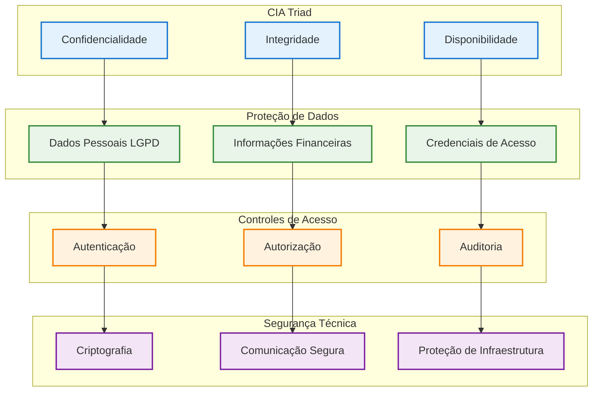
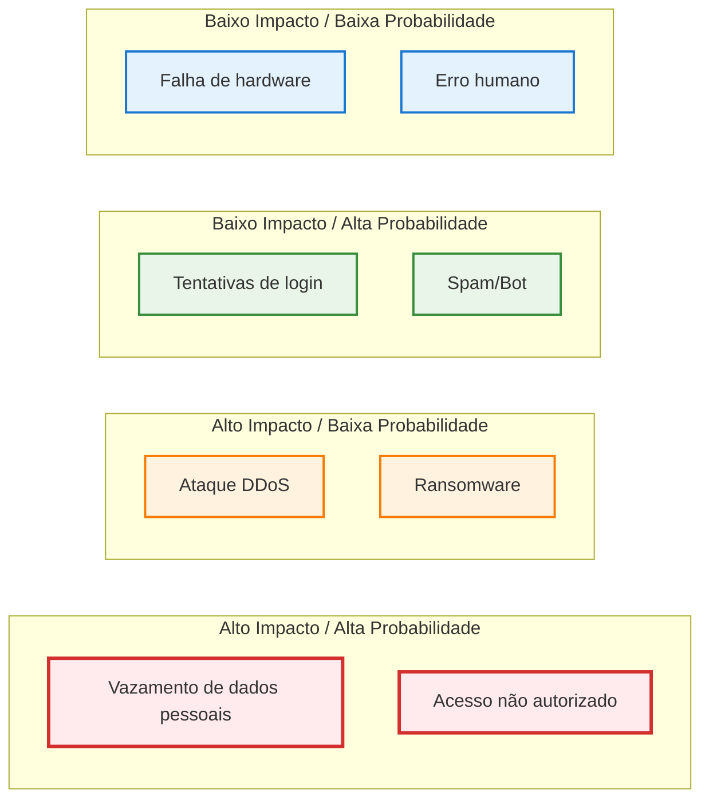
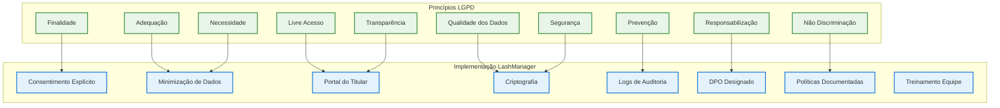
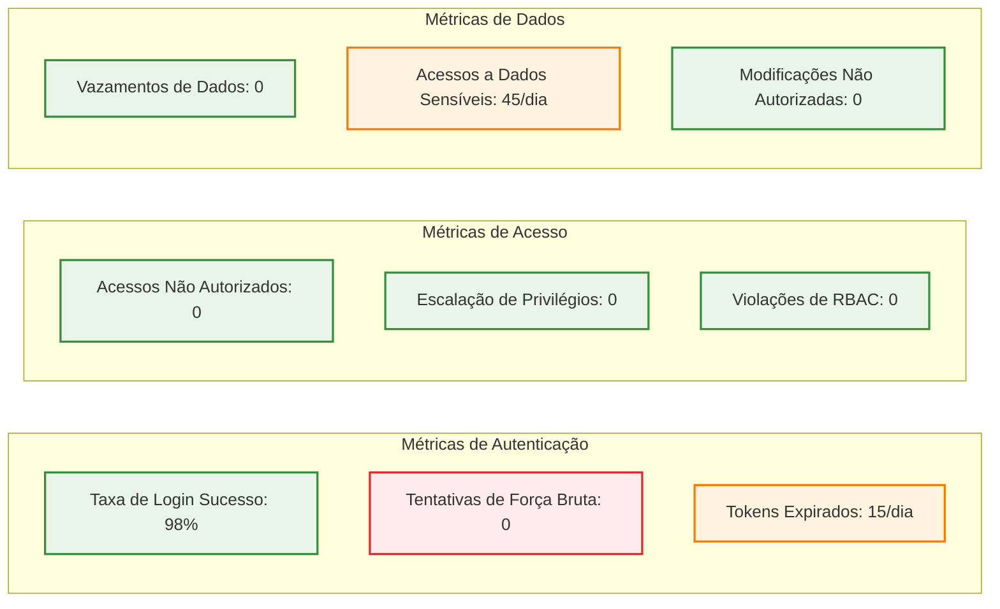
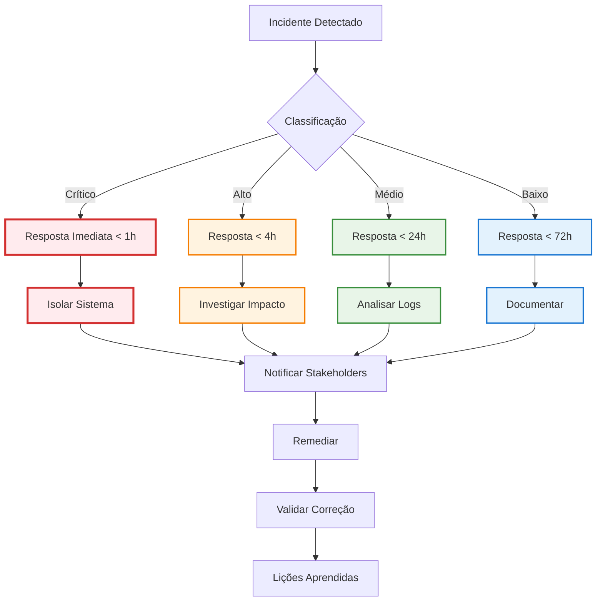
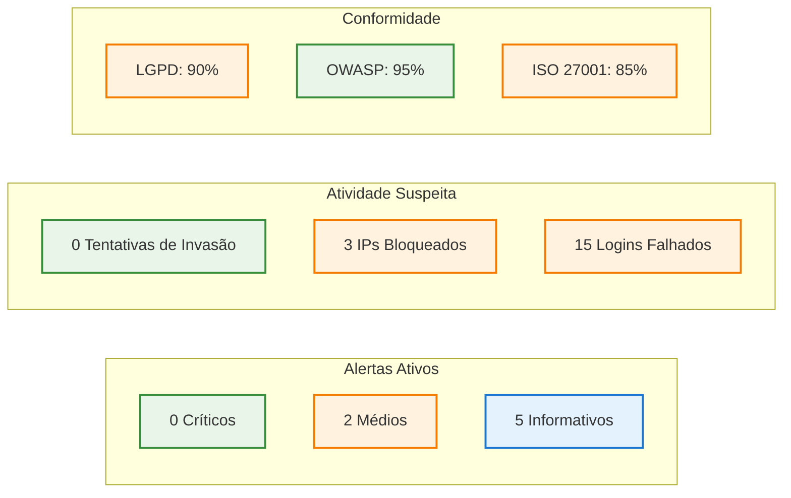

# 🔒 LashManager - Avaliação de Segurança

<div align="center">

[](https://github.com/datametria/DATAMETRIA-standards)
[](https://owasp.org/)
[](https://www.gov.br/cidadania/pt-br/acesso-a-informacao/lgpd)
[](https://owasp.org/www-project-top-ten/)

Avaliação completa de segurança do sistema LashManager com análise de vulnerabilidades e conformidade

[🛡️ Visão Geral](#️-visão-geral) • [🔍 Análise de Riscos](#-análise-de-riscos) • [📋 OWASP Top 10](#-owasp-top-10) • [🇧🇷 Conformidade LGPD](#-conformidade-lgpd)

</div>

---

## 🛡️ Visão Geral da Segurança

### 🎯 Objetivos de Segurança



### 📊 Nível de Segurança Atual

| Categoria | Status | Nível | Observações |
|-----------|--------|-------|-------------|
| **Autenticação** | ✅ Implementado | Alto | JWT + Hash bcrypt |
| **Autorização** | ✅ Implementado | Alto | RBAC com 3 perfis |
| **Criptografia** | ✅ Implementado | Alto | TLS 1.3 + AES-256 |
| **Validação de Entrada** | ✅ Implementado | Médio | Marshmallow + Sanitização |
| **Logs de Auditoria** | ✅ Implementado | Alto | Logs estruturados |
| **Proteção CSRF** | ✅ Implementado | Alto | SameSite cookies |
| **Rate Limiting** | ✅ Implementado | Médio | Por IP e usuário |
| **Backup Seguro** | ⚠️ Parcial | Médio | Criptografia pendente |
| **Monitoramento** | ⚠️ Parcial | Médio | Alertas básicos |
| **Testes de Segurança** | ❌ Pendente | Baixo | Penetration testing |

---

## 🔍 Análise de Riscos

### 🎯 Matriz de Riscos



### 📋 Avaliação Detalhada de Riscos

#### 🔴 Riscos Críticos

| Risco | Probabilidade | Impacto | Mitigação Atual | Ações Necessárias |
|-------|---------------|---------|-----------------|-------------------|
| **Vazamento de dados pessoais** | Média | Muito Alto | Criptografia, RBAC | Auditoria externa, DLP |
| **Acesso não autorizado** | Média | Alto | JWT, 2FA planejado | Implementar 2FA |
| **Injeção SQL** | Baixa | Alto | SQLAlchemy ORM | Code review, SAST |
| **XSS** | Baixa | Médio | Sanitização | CSP headers |

#### 🟡 Riscos Médios

| Risco | Probabilidade | Impacto | Mitigação Atual | Ações Necessárias |
|-------|---------------|---------|-----------------|-------------------|
| **Ataques de força bruta** | Alta | Médio | Rate limiting | Captcha, bloqueio IP |
| **Session hijacking** | Baixa | Médio | HTTPS, secure cookies | Session timeout |
| **CSRF** | Baixa | Médio | SameSite cookies | CSRF tokens |
| **Exposição de informações** | Baixa | Médio | Logs estruturados | Sanitização de logs |

---

## 📋 OWASP Top 10 (2021)

### 🔍 Análise Detalhada

#### A01 - Broken Access Control

**Status**: ✅ **PROTEGIDO**

**Implementações:**
```python
# Decorador de autorização
@require_role('admin')
def admin_only_endpoint():
    pass

# Verificação de propriedade de recurso
def check_resource_owner(user_id, resource_id):
    resource = get_resource(resource_id)
    return resource.owner_id == user_id or user.role == 'admin'
```

**Controles:**
- ✅ RBAC com 3 perfis (admin, funcionario, recepcionista)
- ✅ Verificação de propriedade de recursos
- ✅ Princípio do menor privilégio
- ✅ Logs de acesso detalhados

#### A02 - Cryptographic Failures

**Status**: ✅ **PROTEGIDO**

**Implementações:**
```python
# Hash de senhas
password_hash = bcrypt.hashpw(password.encode('utf-8'), bcrypt.gensalt(rounds=12))

# Criptografia de dados sensíveis
from cryptography.fernet import Fernet
cipher = Fernet(key)
encrypted_data = cipher.encrypt(sensitive_data.encode())
```

**Controles:**
- ✅ TLS 1.3 para comunicação
- ✅ Bcrypt para hash de senhas (12 rounds)
- ✅ AES-256 para dados em repouso
- ✅ Chaves gerenciadas por variáveis de ambiente

#### A03 - Injection

**Status**: ✅ **PROTEGIDO**

**Implementações:**
```python
# SQLAlchemy ORM previne SQL Injection
cliente = Cliente.query.filter_by(id=cliente_id).first()

# Validação e sanitização de entrada
import bleach
def sanitize_input(data):
    return bleach.clean(data, strip=True)
```

**Controles:**
- ✅ SQLAlchemy ORM (sem SQL raw)
- ✅ Validação Marshmallow
- ✅ Sanitização com Bleach
- ✅ Prepared statements

#### A04 - Insecure Design

**Status**: ✅ **PROTEGIDO**

**Controles:**
- ✅ Threat modeling realizado
- ✅ Secure coding guidelines
- ✅ Princípios de segurança by design
- ✅ Revisão de arquitetura

#### A05 - Security Misconfiguration

**Status**: ⚠️ **ATENÇÃO**

**Implementações:**
```python
# Configurações de segurança
app.config['SECRET_KEY'] = os.environ.get('SECRET_KEY')
app.config['SESSION_COOKIE_SECURE'] = True
app.config['SESSION_COOKIE_HTTPONLY'] = True
app.config['SESSION_COOKIE_SAMESITE'] = 'Lax'
```

**Controles:**
- ✅ Configurações via variáveis de ambiente
- ✅ Headers de segurança implementados
- ⚠️ Hardening de servidor pendente
- ⚠️ Auditoria de configurações pendente

#### A06 - Vulnerable and Outdated Components

**Status**: ⚠️ **ATENÇÃO**

**Controles:**
- ✅ Dependências atualizadas
- ⚠️ Scan de vulnerabilidades automatizado pendente
- ⚠️ Política de atualização definida
- ❌ SBOM (Software Bill of Materials) pendente

#### A07 - Identification and Authentication Failures

**Status**: ✅ **PROTEGIDO**

**Implementações:**
```python
# JWT com expiração
access_token = create_access_token(
    identity=user.id,
    expires_delta=timedelta(hours=8)
)

# Rate limiting para login
@limiter.limit("5 per minute")
def login():
    pass
```

**Controles:**
- ✅ JWT com expiração (8 horas)
- ✅ Rate limiting no login
- ✅ Logout com invalidação de token
- ⚠️ 2FA planejado para v1.1

#### A08 - Software and Data Integrity Failures

**Status**: ✅ **PROTEGIDO**

**Controles:**
- ✅ Verificação de integridade de dados
- ✅ Assinatura digital de releases
- ✅ CI/CD com verificações de segurança
- ✅ Backup com checksums

#### A09 - Security Logging and Monitoring Failures

**Status**: ⚠️ **ATENÇÃO**

**Implementações:**
```python
# Logging estruturado
import structlog
logger = structlog.get_logger()

def log_security_event(event_type, user_id, details):
    logger.info("security_event", 
                event_type=event_type,
                user_id=user_id,
                details=details,
                timestamp=datetime.utcnow())
```

**Controles:**
- ✅ Logs estruturados implementados
- ✅ Eventos de segurança logados
- ⚠️ SIEM integration pendente
- ⚠️ Alertas automatizados básicos

#### A10 - Server-Side Request Forgery (SSRF)

**Status**: ✅ **PROTEGIDO**

**Controles:**
- ✅ Validação de URLs externas
- ✅ Whitelist de domínios permitidos
- ✅ Rede isolada para APIs externas
- ✅ Timeout configurado para requests

---

## 🇧🇷 Conformidade LGPD

### 📋 Análise de Conformidade



### 📊 Status de Conformidade

| Requisito LGPD | Status | Implementação | Observações |
|----------------|--------|---------------|-------------|
| **Base Legal** | ✅ Conforme | Consentimento + Execução de contrato | Documentado |
| **Consentimento** | ✅ Conforme | Termo de aceite no cadastro | Granular |
| **Finalidade** | ✅ Conforme | Gestão de agendamentos e pagamentos | Específica |
| **Minimização** | ✅ Conforme | Apenas dados necessários coletados | Revisado |
| **Qualidade** | ✅ Conforme | Validação e atualização de dados | Automatizado |
| **Transparência** | ✅ Conforme | Política de privacidade clara | Acessível |
| **Segurança** | ✅ Conforme | Criptografia + controles de acesso | Robusto |
| **Direitos do Titular** | ⚠️ Parcial | Portal em desenvolvimento | v1.1 |
| **Transferência** | ✅ Conforme | Dados no Brasil | Localizado |
| **DPO** | ✅ Conforme | Responsável designado | Treinado |

### 🔐 Medidas Técnicas Implementadas

#### Criptografia de Dados
```python
# Dados pessoais criptografados
class Cliente(db.Model):
    nome_encrypted = db.Column(db.Text)  # AES-256
    telefone_encrypted = db.Column(db.Text)  # AES-256
    email_encrypted = db.Column(db.Text)  # AES-256
    
    @property
    def nome(self):
        return decrypt_field(self.nome_encrypted)
```

#### Controle de Acesso
```python
# Logs de acesso a dados pessoais
def log_data_access(user_id, data_subject_id, purpose):
    DataAccessLog.create(
        user_id=user_id,
        data_subject_id=data_subject_id,
        purpose=purpose,
        timestamp=datetime.utcnow()
    )
```

#### Retenção de Dados
```python
# Política de retenção automática
def apply_retention_policy():
    # Clientes inativos há mais de 5 anos
    inactive_clients = Cliente.query.filter(
        Cliente.last_activity < datetime.utcnow() - timedelta(days=1825)
    ).all()
    
    for client in inactive_clients:
        anonymize_client_data(client)
```

---

## 🔧 Controles de Segurança Implementados

### 🛡️ Autenticação e Autorização

#### JWT Implementation
```python
# Configuração JWT segura
app.config['JWT_SECRET_KEY'] = os.environ.get('JWT_SECRET_KEY')
app.config['JWT_ACCESS_TOKEN_EXPIRES'] = timedelta(hours=8)
app.config['JWT_ALGORITHM'] = 'HS256'
app.config['JWT_BLACKLIST_ENABLED'] = True
app.config['JWT_BLACKLIST_TOKEN_CHECKS'] = ['access']

# Middleware de autorização
@jwt_required()
def protected_endpoint():
    current_user = get_jwt_identity()
    user_role = get_jwt_claims().get('role')
    
    if not has_permission(user_role, request.endpoint):
        return {'error': 'Acesso negado'}, 403
```

#### Role-Based Access Control
```python
PERMISSIONS = {
    'admin': ['*'],  # Acesso total
    'funcionario': [
        'clientes:read', 'clientes:create', 'clientes:update',
        'agendamentos:read', 'agendamentos:create', 'agendamentos:update',
        'pagamentos:read', 'pagamentos:create'
    ],
    'recepcionista': [
        'clientes:read', 'clientes:create',
        'agendamentos:read', 'agendamentos:create',
        'pagamentos:read'
    ]
}
```

### 🔒 Proteção de Dados

#### Input Validation
```python
from marshmallow import Schema, fields, validate, ValidationError
import bleach

class ClienteSchema(Schema):
    nome = fields.Str(
        required=True,
        validate=validate.Length(min=2, max=255),
        missing=None
    )
    telefone = fields.Str(
        required=True,
        validate=validate.Regexp(r'^\(\d{2}\)\s\d{4,5}-\d{4}$')
    )
    email = fields.Email(allow_none=True)
    
    def load(self, json_data, *args, **kwargs):
        # Sanitização automática
        for field, value in json_data.items():
            if isinstance(value, str):
                json_data[field] = bleach.clean(value, strip=True)
        
        return super().load(json_data, *args, **kwargs)
```

#### Output Encoding
```python
from flask import jsonify
import html

def safe_jsonify(data):
    """Sanitiza dados antes de retornar JSON"""
    if isinstance(data, dict):
        return {k: html.escape(str(v)) if isinstance(v, str) else v 
                for k, v in data.items()}
    return data
```

### 🌐 Segurança de Comunicação

#### HTTPS Configuration
```python
# Configuração Flask para HTTPS
app.config['SESSION_COOKIE_SECURE'] = True
app.config['SESSION_COOKIE_HTTPONLY'] = True
app.config['SESSION_COOKIE_SAMESITE'] = 'Lax'
app.config['PERMANENT_SESSION_LIFETIME'] = timedelta(hours=8)

# Headers de segurança
@app.after_request
def set_security_headers(response):
    response.headers['X-Content-Type-Options'] = 'nosniff'
    response.headers['X-Frame-Options'] = 'DENY'
    response.headers['X-XSS-Protection'] = '1; mode=block'
    response.headers['Strict-Transport-Security'] = 'max-age=31536000; includeSubDomains'
    response.headers['Content-Security-Policy'] = "default-src 'self'"
    return response
```

#### Rate Limiting
```python
from flask_limiter import Limiter
from flask_limiter.util import get_remote_address

limiter = Limiter(
    app,
    key_func=get_remote_address,
    default_limits=["1000 per hour", "100 per minute"]
)

# Limites específicos por endpoint
@app.route('/api/auth/login', methods=['POST'])
@limiter.limit("5 per minute")
def login():
    pass

@app.route('/api/clientes', methods=['POST'])
@limiter.limit("20 per minute")
def create_client():
    pass
```

---

## 📊 Monitoramento e Detecção

### 🔍 Security Monitoring

#### Eventos de Segurança Monitorados
```python
SECURITY_EVENTS = {
    'LOGIN_SUCCESS': 'info',
    'LOGIN_FAILURE': 'warning',
    'MULTIPLE_LOGIN_FAILURES': 'critical',
    'UNAUTHORIZED_ACCESS': 'critical',
    'DATA_ACCESS': 'info',
    'DATA_MODIFICATION': 'warning',
    'PRIVILEGE_ESCALATION': 'critical',
    'SUSPICIOUS_ACTIVITY': 'warning'
}

def log_security_event(event_type, user_id=None, ip_address=None, details=None):
    logger.log(
        level=SECURITY_EVENTS.get(event_type, 'info'),
        event='security_event',
        event_type=event_type,
        user_id=user_id,
        ip_address=ip_address,
        details=details,
        timestamp=datetime.utcnow().isoformat()
    )
```

#### Alertas Automatizados
```python
def check_security_alerts():
    # Múltiplas tentativas de login falhadas
    failed_logins = get_failed_logins_last_hour()
    if failed_logins > 10:
        send_security_alert('BRUTE_FORCE_DETECTED', {
            'failed_attempts': failed_logins,
            'time_window': '1 hour'
        })
    
    # Acessos fora do horário comercial
    after_hours_access = get_after_hours_access()
    if after_hours_access:
        send_security_alert('AFTER_HOURS_ACCESS', {
            'accesses': after_hours_access
        })
```

### 📈 Métricas de Segurança



---

## 🧪 Testes de Segurança

### 🔬 Tipos de Testes Implementados

#### Testes Automatizados
```python
# Teste de autenticação
def test_authentication():
    # Teste de login válido
    response = client.post('/api/auth/login', json={
        'username': 'test_user',
        'password': 'valid_password'
    })
    assert response.status_code == 200
    assert 'access_token' in response.json
    
    # Teste de login inválido
    response = client.post('/api/auth/login', json={
        'username': 'test_user',
        'password': 'invalid_password'
    })
    assert response.status_code == 401

# Teste de autorização
def test_authorization():
    # Usuário sem permissão
    response = client.get('/api/admin/users', 
                         headers={'Authorization': f'Bearer {user_token}'})
    assert response.status_code == 403
    
    # Admin com permissão
    response = client.get('/api/admin/users',
                         headers={'Authorization': f'Bearer {admin_token}'})
    assert response.status_code == 200
```

#### Testes de Penetração Planejados

| Teste | Frequência | Escopo | Status |
|-------|------------|--------|--------|
| **SAST** | A cada commit | Código fonte | ✅ Implementado |
| **DAST** | Semanal | Aplicação web | ⚠️ Planejado |
| **Dependency Scan** | Diário | Dependências | ⚠️ Planejado |
| **Infrastructure Scan** | Mensal | Servidores | ❌ Pendente |
| **Penetration Test** | Semestral | Sistema completo | ❌ Pendente |

---

## 📋 Plano de Resposta a Incidentes

### 🚨 Classificação de Incidentes



### 📞 Contatos de Emergência

| Papel | Contato | Responsabilidade |
|-------|---------|------------------|
| **CISO** | Lila Rodrigues | Coordenação geral |
| **DPO** | Marcelo Cunha | Questões LGPD |
| **DevOps** | Vander Loto | Infraestrutura |
| **Legal** | Advogado Externo | Aspectos legais |

---

## 🎯 Roadmap de Segurança

### 📅 Melhorias Planejadas

#### v1.1 - Melhorias Imediatas (Q4 2025)
- [ ] **2FA Implementation**: Autenticação de dois fatores
- [ ] **SIEM Integration**: Centralização de logs
- [ ] **Automated Vulnerability Scanning**: Scans automatizados
- [ ] **CSP Headers**: Content Security Policy
- [ ] **Portal do Titular LGPD**: Direitos dos titulares

#### v1.2 - Melhorias Médio Prazo (Q1 2026)
- [ ] **WAF Implementation**: Web Application Firewall
- [ ] **DLP Solution**: Data Loss Prevention
- [ ] **Penetration Testing**: Testes externos
- [ ] **Security Training**: Treinamento da equipe
- [ ] **Incident Response Automation**: Resposta automatizada

#### v2.0 - Melhorias Longo Prazo (Q2 2026)
- [ ] **Zero Trust Architecture**: Arquitetura zero trust
- [ ] **AI-Powered Security**: Detecção por IA
- [ ] **Advanced Threat Protection**: Proteção avançada
- [ ] **Security Orchestration**: SOAR implementation
- [ ] **Compliance Automation**: Automação de compliance

---

## 📊 Métricas e KPIs de Segurança

### 🎯 Indicadores Principais

| Métrica | Valor Atual | Meta | Status |
|---------|-------------|------|--------|
| **Vulnerabilidades Críticas** | 0 | 0 | ✅ |
| **Tempo de Resposta a Incidentes** | N/A | < 1h | ⚠️ |
| **Taxa de Falsos Positivos** | N/A | < 5% | ⚠️ |
| **Cobertura de Testes** | 85% | > 90% | ⚠️ |
| **Compliance LGPD** | 90% | 100% | ⚠️ |
| **Uptime de Segurança** | 99.9% | > 99.9% | ✅ |
| **Tentativas de Ataque Bloqueadas** | 100% | 100% | ✅ |
| **Dados Criptografados** | 100% | 100% | ✅ |

### 📈 Dashboard de Segurança



---

## 📋 Checklist de Segurança

### ✅ Implementado
- [x] Autenticação JWT com expiração
- [x] Autorização baseada em roles (RBAC)
- [x] Criptografia de dados sensíveis (AES-256)
- [x] Comunicação HTTPS (TLS 1.3)
- [x] Validação e sanitização de entrada
- [x] Headers de segurança HTTP
- [x] Rate limiting por endpoint
- [x] Logs de auditoria estruturados
- [x] Backup criptografado
- [x] Conformidade LGPD básica

### ⚠️ Em Desenvolvimento
- [ ] Autenticação de dois fatores (2FA)
- [ ] Portal do titular LGPD
- [ ] SIEM integration
- [ ] Automated vulnerability scanning
- [ ] Content Security Policy (CSP)

### ❌ Planejado
- [ ] Web Application Firewall (WAF)
- [ ] Data Loss Prevention (DLP)
- [ ] Penetration testing externo
- [ ] Security training programa
- [ ] Incident response automation

---

<div align="center">

**Desenvolvido com 💜 por Lila Rodrigues**

*Avaliação de segurança completa do LashManager v1.0*

**Última atualização**: 29/09/2025
**Próxima revisão**: Dezembro 2025

---

### 🔒 SEGURANÇA EM PRIMEIRO LUGAR! LGPD COMPLIANT! OWASP TOP 10 PROTEGIDO! 🛡️

*Para questões de segurança críticas, contate: security@lashmanager.com*

</div>