# 🏗️ LashManager - Diagrama de Arquitetura Técnica

Arquitetura técnica completa do sistema LashManager com diagramas detalhados

[🏛️ Visão Geral](#️-visão-geral) • [🔄 Fluxo de Dados](#-fluxo-de-dados) • [🗄️ Modelo de Dados](#️-modelo-de-dados) • [🚀 Deploy](#-deploy)

---

## 🏛️ Visão Geral da Arquitetura

### 🎯 Arquitetura de Alto Nível

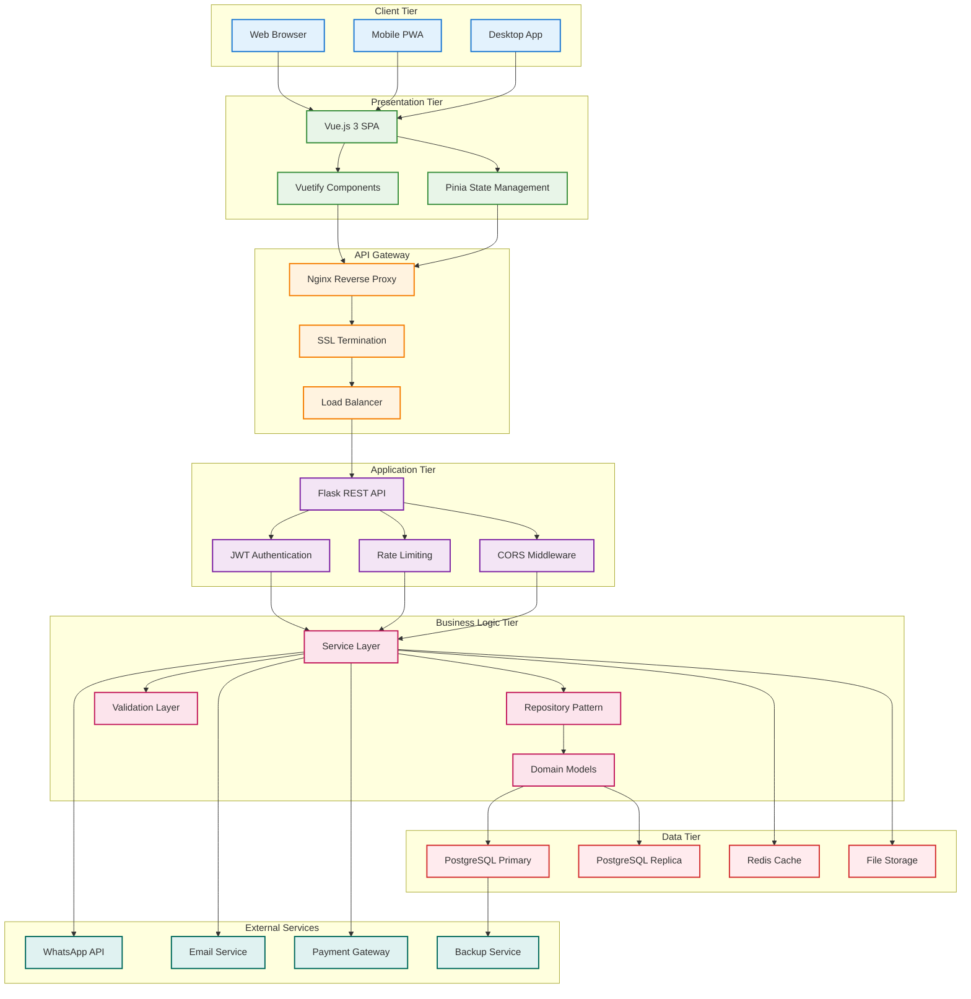
```mermaid
graph TB
    subgraph "Client Tier"
        A[Web Browser]
        B[Mobile PWA]
        C[Desktop App]
    end

    subgraph "Presentation Tier"
        D[Vue.js 3 SPA]
        E[Vuetify Components]
        F[Pinia State Management]
    end

    subgraph "API Gateway"
        G[Nginx Reverse Proxy]
        H[SSL Termination]
        I[Load Balancer]
    end

    subgraph "Application Tier"
        J[Flask REST API]
        K[JWT Authentication]
        L[Rate Limiting]
        M[CORS Middleware]
    end

    subgraph "Business Logic Tier"
        N[Service Layer]
        O[Repository Pattern]
        P[Domain Models]
        Q[Validation Layer]
    end

    subgraph "Data Tier"
        R[PostgreSQL Primary]
        S[PostgreSQL Replica]
        T[Redis Cache]
        U[File Storage]
    end

    subgraph "External Services"
        V[WhatsApp API]
        W[Email Service]
        X[Payment Gateway]
        Y[Backup Service]
    end

    %% Connections
    A --> D
    B --> D
    C --> D
    D --> E
    D --> F
    E --> G
    F --> G
    G --> H
    H --> I
    I --> J
    J --> K
    J --> L
    J --> M
    K --> N
    L --> N
    M --> N
    N --> O
    N --> Q
    O --> P
    P --> R
    P --> S
    N --> T
    N --> U
    N --> V
    N --> W
    N --> X
    R --> Y

    %% Styling
    classDef client fill:#E3F2FD,stroke:#1976D2,stroke-width:2px
    classDef presentation fill:#E8F5E8,stroke:#388E3C,stroke-width:2px
    classDef gateway fill:#FFF3E0,stroke:#F57C00,stroke-width:2px
    classDef application fill:#F3E5F5,stroke:#7B1FA2,stroke-width:2px
    classDef business fill:#FCE4EC,stroke:#C2185B,stroke-width:2px
    classDef data fill:#FFEBEE,stroke:#D32F2F,stroke-width:2px
    classDef external fill:#E0F2F1,stroke:#00695C,stroke-width:2px

    class A,B,C client
    class D,E,F presentation
    class G,H,I gateway
    class J,K,L,M application
    class N,O,P,Q business
    class R,S,T,U data
    class V,W,X,Y external
```

### 🔄 Clean Architecture Layers

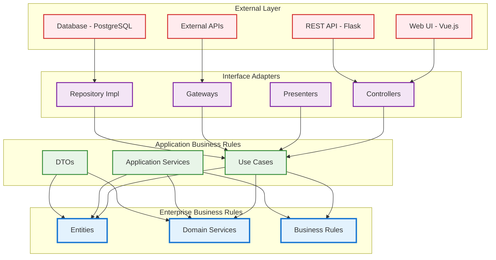
```mermaid
graph TB
    subgraph "External Layer"
        A[Web UI - Vue.js]
        B[REST API - Flask]
        C[Database - PostgreSQL]
        D[External APIs]
    end

    subgraph "Interface Adapters"
        E[Controllers]
        F[Presenters]
        G[Gateways]
        H[Repository Impl]
    end

    subgraph "Application Business Rules"
        I[Use Cases]
        J[Application Services]
        K[DTOs]
    end

    subgraph "Enterprise Business Rules"
        L[Entities]
        M[Domain Services]
        N[Business Rules]
    end

    %% Dependencies (pointing inward)
    A --> E
    B --> E
    C --> H
    D --> G
    E --> I
    F --> I
    G --> I
    H --> I
    I --> L
    J --> L
    K --> L
    I --> M
    J --> M
    K --> M
    I --> N
    J --> N

    %% Styling
    classDef external fill:#FFEBEE,stroke:#D32F2F,stroke-width:2px
    classDef adapters fill:#F3E5F5,stroke:#7B1FA2,stroke-width:2px
    classDef application fill:#E8F5E8,stroke:#388E3C,stroke-width:2px
    classDef enterprise fill:#E3F2FD,stroke:#1976D2,stroke-width:3px

    class A,B,C,D external
    class E,F,G,H adapters
    class I,J,K application
    class L,M,N enterprise
```

---

## 🔄 Fluxo de Dados e Comunicação

### 📊 Fluxo de Requisição Completo

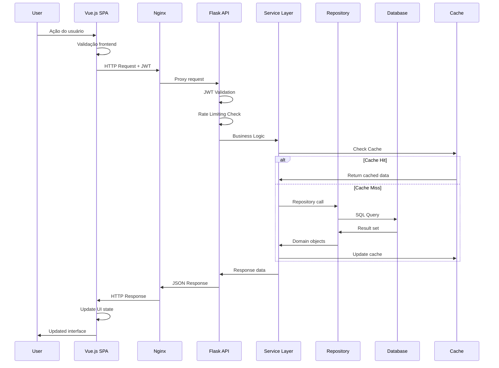
```mermaid
sequenceDiagram
    participant U as User
    participant V as Vue.js SPA
    participant N as Nginx
    participant F as Flask API
    participant S as Service Layer
    participant R as Repository
    participant D as Database
    participant C as Cache

    U->>V: Ação do usuário
    V->>V: Validação frontend
    V->>N: HTTP Request + JWT
    N->>F: Proxy request
    F->>F: JWT Validation
    F->>F: Rate Limiting Check
    F->>S: Business Logic
    S->>C: Check Cache
    alt Cache Hit
        C->>S: Return cached data
    else Cache Miss
        S->>R: Repository call
        R->>D: SQL Query
        D->>R: Result set
        R->>S: Domain objects
        S->>C: Update cache
    end
    S->>F: Response data
    F->>N: JSON Response
    N->>V: HTTP Response
    V->>V: Update UI state
    V->>U: Updated interface
```

### 🔐 Fluxo de Autenticação

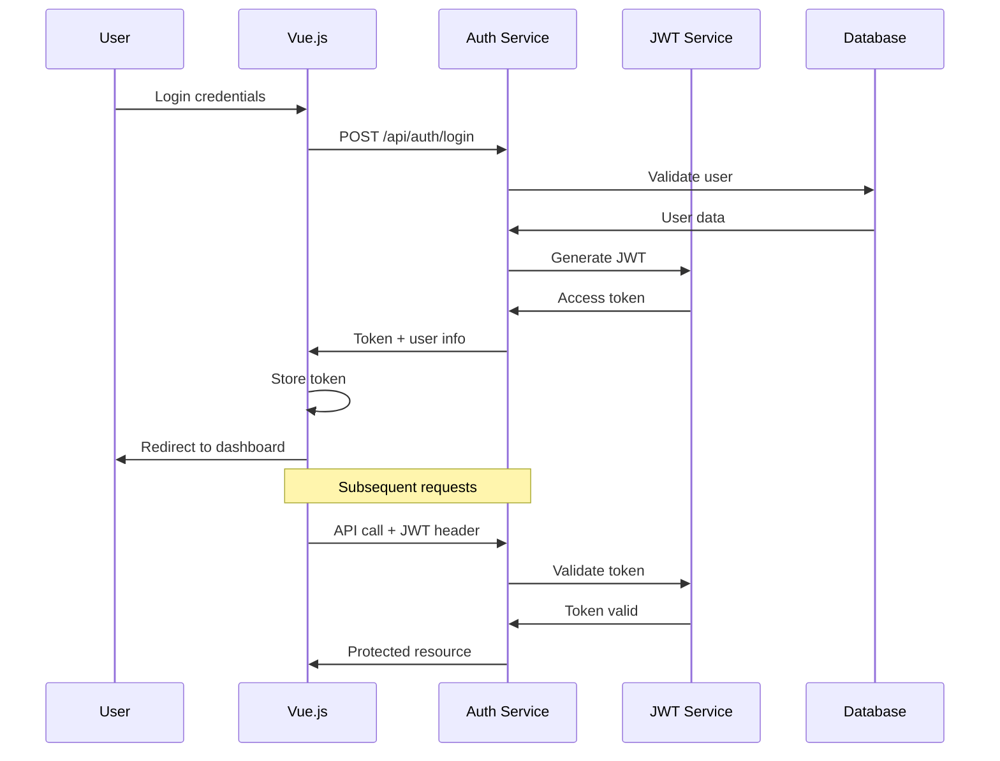
```mermaid
sequenceDiagram
    participant U as User
    participant V as Vue.js
    participant A as Auth Service
    participant J as JWT Service
    participant D as Database

    U->>V: Login credentials
    V->>A: POST /api/auth/login
    A->>D: Validate user
    D->>A: User data
    A->>J: Generate JWT
    J->>A: Access token
    A->>V: Token + user info
    V->>V: Store token
    V->>U: Redirect to dashboard

    Note over V,A: Subsequent requests
    V->>A: API call + JWT header
    A->>J: Validate token
    J->>A: Token valid
    A->>V: Protected resource
```

### 📱 Fluxo de Agendamento

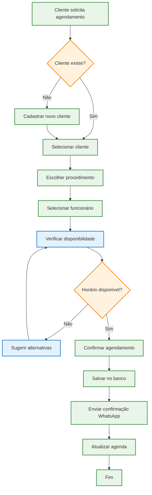
```mermaid
flowchart TD
    A[Cliente solicita agendamento] --> B{Cliente existe?}
    B -->|Não| C[Cadastrar novo cliente]
    B -->|Sim| D[Selecionar cliente]
    C --> D
    D --> E[Escolher procedimento]
    E --> F[Selecionar funcionário]
    F --> G[Verificar disponibilidade]
    G --> H{Horário disponível?}
    H -->|Não| I[Sugerir alternativas]
    H -->|Sim| J[Confirmar agendamento]
    I --> G
    J --> K[Salvar no banco]
    K --> L[Enviar confirmação WhatsApp]
    L --> M[Atualizar agenda]
    M --> N[Fim]

    %% Styling
    classDef process fill:#E8F5E8,stroke:#388E3C,stroke-width:2px
    classDef decision fill:#FFF3E0,stroke:#F57C00,stroke-width:2px
    classDef action fill:#E3F2FD,stroke:#1976D2,stroke-width:2px

    class A,C,D,E,F,J,K,L,M,N process
    class B,H decision
    class G,I action
```

---

## 🗄️ Modelo de Dados Detalhado

### 📋 Diagrama Entidade-Relacionamento

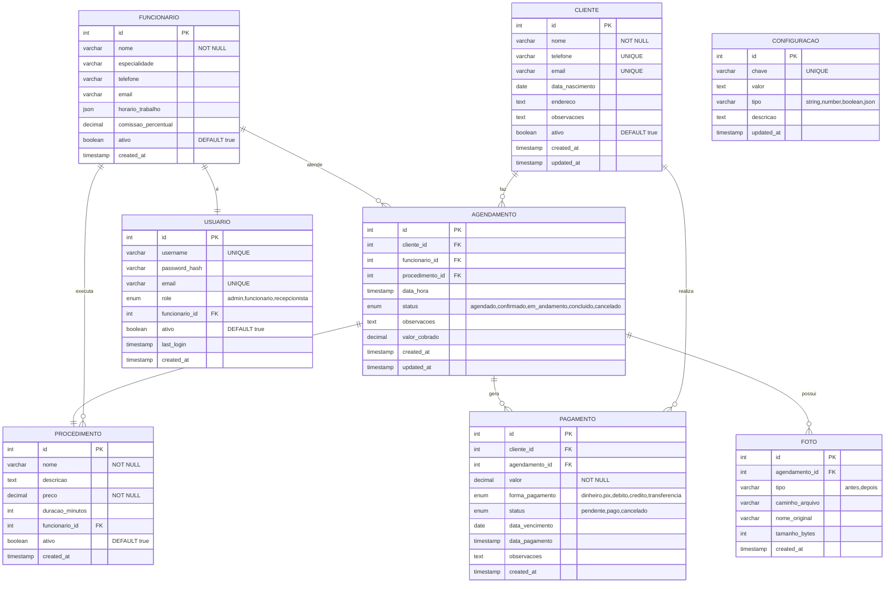
```mermaid
erDiagram
    CLIENTE ||--o{ AGENDAMENTO : "faz"
    CLIENTE ||--o{ PAGAMENTO : "realiza"
    FUNCIONARIO ||--o{ AGENDAMENTO : "atende"
    FUNCIONARIO ||--o{ PROCEDIMENTO : "executa"
    FUNCIONARIO ||--|| USUARIO : "é"
    AGENDAMENTO ||--|| PROCEDIMENTO : "inclui"
    AGENDAMENTO ||--o{ PAGAMENTO : "gera"
    AGENDAMENTO ||--o{ FOTO : "possui"

    CLIENTE {
        int id PK
        varchar nome "NOT NULL"
        varchar telefone "UNIQUE"
        varchar email "UNIQUE"
        date data_nascimento
        text endereco
        text observacoes
        boolean ativo "DEFAULT true"
        timestamp created_at
        timestamp updated_at
    }

    FUNCIONARIO {
        int id PK
        varchar nome "NOT NULL"
        varchar especialidade
        varchar telefone
        varchar email
        json horario_trabalho
        decimal comissao_percentual
        boolean ativo "DEFAULT true"
        timestamp created_at
    }

    USUARIO {
        int id PK
        varchar username "UNIQUE"
        varchar password_hash
        varchar email "UNIQUE"
        enum role "admin,funcionario,recepcionista"
        int funcionario_id FK
        boolean ativo "DEFAULT true"
        timestamp last_login
        timestamp created_at
    }

    PROCEDIMENTO {
        int id PK
        varchar nome "NOT NULL"
        text descricao
        decimal preco "NOT NULL"
        int duracao_minutos
        int funcionario_id FK
        boolean ativo "DEFAULT true"
        timestamp created_at
    }

    AGENDAMENTO {
        int id PK
        int cliente_id FK
        int funcionario_id FK
        int procedimento_id FK
        timestamp data_hora
        enum status "agendado,confirmado,em_andamento,concluido,cancelado"
        text observacoes
        decimal valor_cobrado
        timestamp created_at
        timestamp updated_at
    }

    PAGAMENTO {
        int id PK
        int cliente_id FK
        int agendamento_id FK
        decimal valor "NOT NULL"
        enum forma_pagamento "dinheiro,pix,debito,credito,transferencia"
        enum status "pendente,pago,cancelado"
        date data_vencimento
        timestamp data_pagamento
        text observacoes
        timestamp created_at
    }

    FOTO {
        int id PK
        int agendamento_id FK
        varchar tipo "antes,depois"
        varchar caminho_arquivo
        varchar nome_original
        int tamanho_bytes
        timestamp created_at
    }

    CONFIGURACAO {
        int id PK
        varchar chave "UNIQUE"
        text valor
        varchar tipo "string,number,boolean,json"
        text descricao
        timestamp updated_at
    }
```

### 🔍 Índices e Otimizações

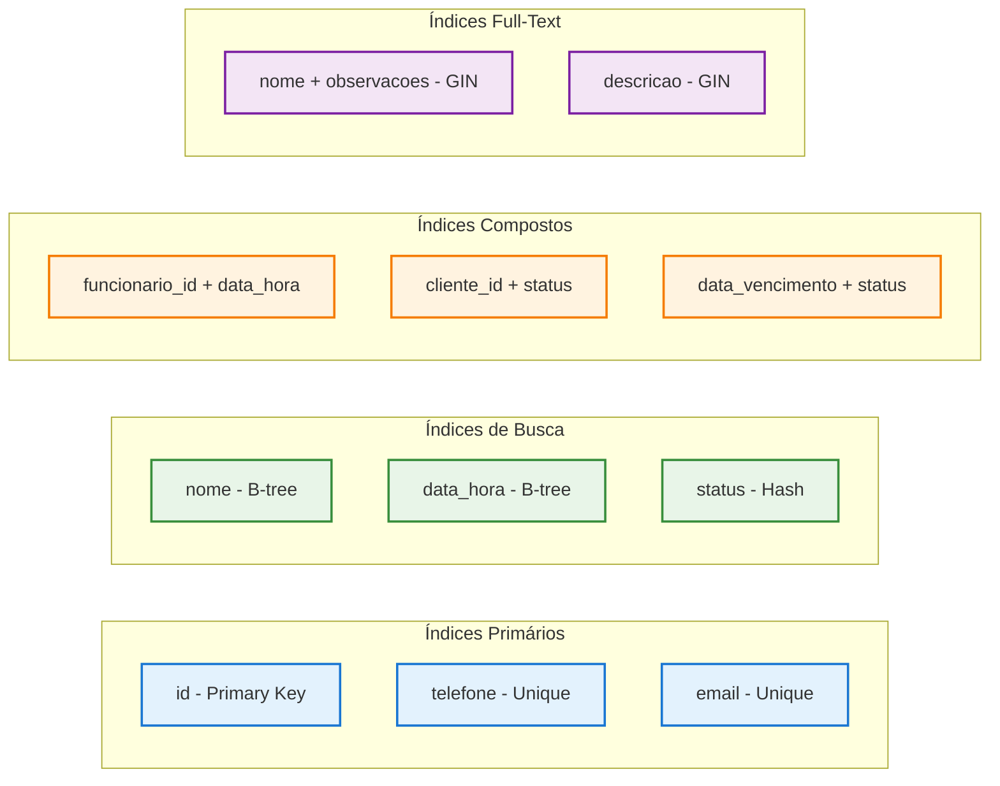
```mermaid
graph LR
    subgraph "Índices Primários"
        A[id - Primary Key]
        B[telefone - Unique]
        C[email - Unique]
    end

    subgraph "Índices de Busca"
        D[nome - B-tree]
        E[data_hora - B-tree]
        F[status - Hash]
    end

    subgraph "Índices Compostos"
        G[funcionario_id + data_hora]
        H[cliente_id + status]
        I[data_vencimento + status]
    end

    subgraph "Índices Full-Text"
        J[nome + observacoes - GIN]
        K[descricao - GIN]
    end

    %% Styling
    classDef primary fill:#E3F2FD,stroke:#1976D2,stroke-width:2px
    classDef search fill:#E8F5E8,stroke:#388E3C,stroke-width:2px
    classDef composite fill:#FFF3E0,stroke:#F57C00,stroke-width:2px
    classDef fulltext fill:#F3E5F5,stroke:#7B1FA2,stroke-width:2px

    class A,B,C primary
    class D,E,F search
    class G,H,I composite
    class J,K fulltext
```

---

## 🎨 Arquitetura Frontend

### 🔄 Estrutura de Componentes Vue.js

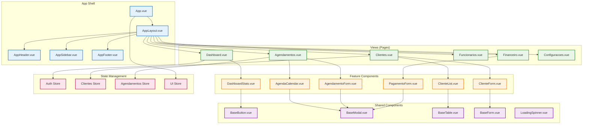
```mermaid
graph TB
    subgraph "App Shell"
        A[App.vue]
        B[AppLayout.vue]
        C[AppHeader.vue]
        D[AppSidebar.vue]
        E[AppFooter.vue]
    end

    subgraph "Views (Pages)"
        F[Dashboard.vue]
        G[Clientes.vue]
        H[Agendamentos.vue]
        I[Funcionarios.vue]
        J[Financeiro.vue]
        K[Configuracoes.vue]
    end

    subgraph "Feature Components"
        L[ClienteList.vue]
        M[ClienteForm.vue]
        N[AgendaCalendar.vue]
        O[AgendamentoForm.vue]
        P[PagamentoForm.vue]
        Q[DashboardStats.vue]
    end

    subgraph "Shared Components"
        R[BaseButton.vue]
        S[BaseModal.vue]
        T[BaseTable.vue]
        U[BaseForm.vue]
        V[LoadingSpinner.vue]
    end

    subgraph "State Management"
        W[Auth Store]
        X[Clientes Store]
        Y[Agendamentos Store]
        Z[UI Store]
    end

    %% Connections
    A --> B
    B --> C
    B --> D
    B --> E
    B --> F
    B --> G
    B --> H
    B --> I
    B --> J
    B --> K
    G --> L
    G --> M
    H --> N
    H --> O
    J --> P
    F --> Q
    L --> T
    M --> U
    N --> S
    O --> S
    P --> S
    Q --> R
    F --> W
    G --> X
    H --> Y
    A --> Z

    %% Styling
    classDef shell fill:#E3F2FD,stroke:#1976D2,stroke-width:2px
    classDef views fill:#E8F5E8,stroke:#388E3C,stroke-width:2px
    classDef features fill:#FFF3E0,stroke:#F57C00,stroke-width:2px
    classDef shared fill:#F3E5F5,stroke:#7B1FA2,stroke-width:2px
    classDef state fill:#FCE4EC,stroke:#C2185B,stroke-width:2px

    class A,B,C,D,E shell
    class F,G,H,I,J,K views
    class L,M,N,O,P,Q features
    class R,S,T,U,V shared
    class W,X,Y,Z state
```

### 📱 Responsividade e PWA

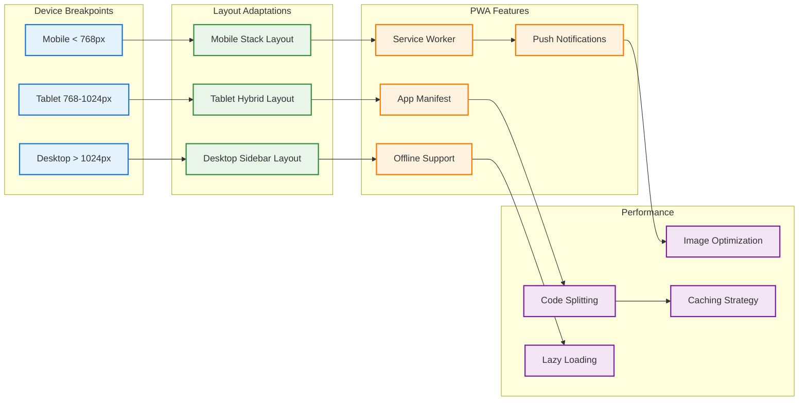
```mermaid
graph LR
    subgraph "Device Breakpoints"
        A[Mobile < 768px]
        B[Tablet 768-1024px]
        C[Desktop > 1024px]
    end

    subgraph "Layout Adaptations"
        D[Mobile Stack Layout]
        E[Tablet Hybrid Layout]
        F[Desktop Sidebar Layout]
    end

    subgraph "PWA Features"
        G[Service Worker]
        H[App Manifest]
        I[Offline Support]
        J[Push Notifications]
    end

    subgraph "Performance"
        K[Code Splitting]
        L[Lazy Loading]
        M[Image Optimization]
        N[Caching Strategy]
    end

    A --> D
    B --> E
    C --> F
    D --> G
    E --> H
    F --> I
    G --> J
    H --> K
    I --> L
    J --> M
    K --> N

    %% Styling
    classDef devices fill:#E3F2FD,stroke:#1976D2,stroke-width:2px
    classDef layouts fill:#E8F5E8,stroke:#388E3C,stroke-width:2px
    classDef pwa fill:#FFF3E0,stroke:#F57C00,stroke-width:2px
    classDef performance fill:#F3E5F5,stroke:#7B1FA2,stroke-width:2px

    class A,B,C devices
    class D,E,F layouts
    class G,H,I,J pwa
    class K,L,M,N performance
```

---

## 🔧 Arquitetura Backend

### 🏗️ Estrutura de Camadas Flask

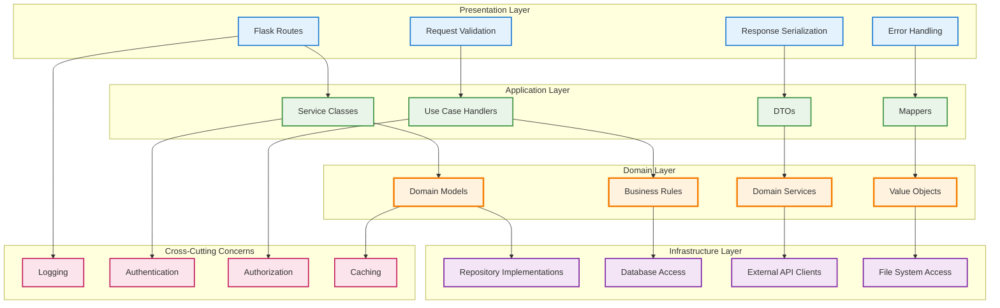
```mermaid
graph TB
    subgraph "Presentation Layer"
        A[Flask Routes]
        B[Request Validation]
        C[Response Serialization]
        D[Error Handling]
    end

    subgraph "Application Layer"
        E[Service Classes]
        F[Use Case Handlers]
        G[DTOs]
        H[Mappers]
    end

    subgraph "Domain Layer"
        I[Domain Models]
        J[Business Rules]
        K[Domain Services]
        L[Value Objects]
    end

    subgraph "Infrastructure Layer"
        M[Repository Implementations]
        N[Database Access]
        O[External API Clients]
        P[File System Access]
    end

    subgraph "Cross-Cutting Concerns"
        Q[Logging]
        R[Authentication]
        S[Authorization]
        T[Caching]
    end

    %% Dependencies
    A --> E
    B --> F
    C --> G
    D --> H
    E --> I
    F --> J
    G --> K
    H --> L
    I --> M
    J --> N
    K --> O
    L --> P
    A --> Q
    E --> R
    F --> S
    I --> T

    %% Styling
    classDef presentation fill:#E3F2FD,stroke:#1976D2,stroke-width:2px
    classDef application fill:#E8F5E8,stroke:#388E3C,stroke-width:2px
    classDef domain fill:#FFF3E0,stroke:#F57C00,stroke-width:3px
    classDef infrastructure fill:#F3E5F5,stroke:#7B1FA2,stroke-width:2px
    classDef crosscutting fill:#FCE4EC,stroke:#C2185B,stroke-width:2px

    class A,B,C,D presentation
    class E,F,G,H application
    class I,J,K,L domain
    class M,N,O,P infrastructure
    class Q,R,S,T crosscutting
```

### 🔐 Middleware Stack

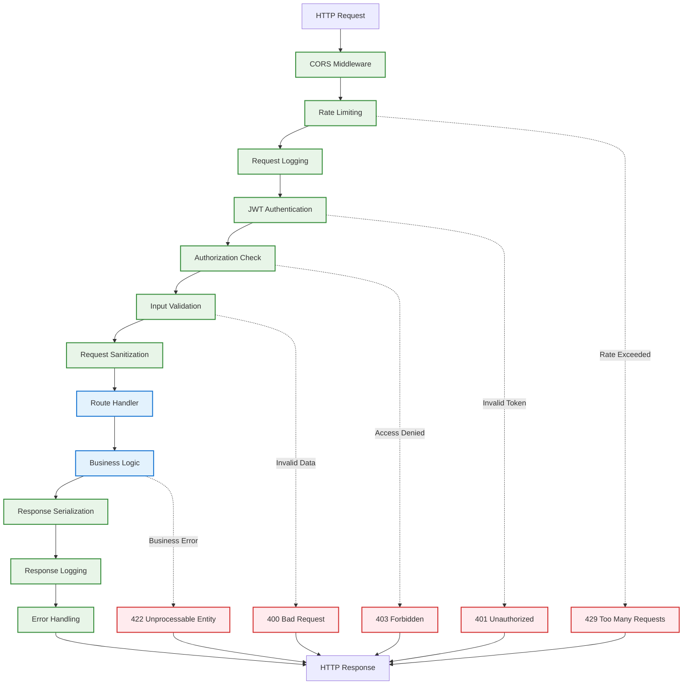
```mermaid
flowchart TD
    A[HTTP Request] --> B[CORS Middleware]
    B --> C[Rate Limiting]
    C --> D[Request Logging]
    D --> E[JWT Authentication]
    E --> F[Authorization Check]
    F --> G[Input Validation]
    G --> H[Request Sanitization]
    H --> I[Route Handler]
    I --> J[Business Logic]
    J --> K[Response Serialization]
    K --> L[Response Logging]
    L --> M[Error Handling]
    M --> N[HTTP Response]

    %% Error flows
    C -.->|Rate Exceeded| O[429 Too Many Requests]
    E -.->|Invalid Token| P[401 Unauthorized]
    F -.->|Access Denied| Q[403 Forbidden]
    G -.->|Invalid Data| R[400 Bad Request]
    J -.->|Business Error| S[422 Unprocessable Entity]

    O --> N
    P --> N
    Q --> N
    R --> N
    S --> N

    %% Styling
    classDef middleware fill:#E8F5E8,stroke:#388E3C,stroke-width:2px
    classDef handler fill:#E3F2FD,stroke:#1976D2,stroke-width:2px
    classDef error fill:#FFEBEE,stroke:#D32F2F,stroke-width:2px

    class B,C,D,E,F,G,H,K,L,M middleware
    class I,J handler
    class O,P,Q,R,S error
```

---

## 🚀 Arquitetura de Deploy

### 🐳 Containerização Docker

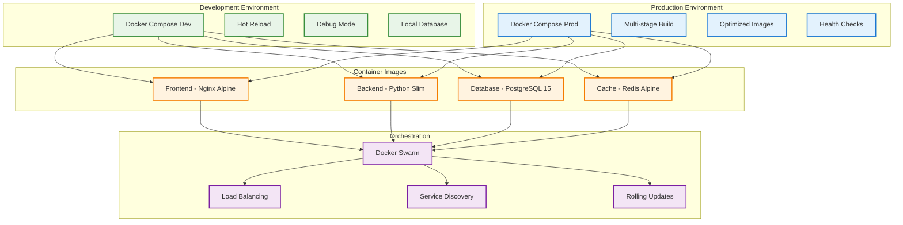
```mermaid
graph TB
    subgraph "Development Environment"
        A[Docker Compose Dev]
        B[Hot Reload]
        C[Debug Mode]
        D[Local Database]
    end

    subgraph "Production Environment"
        E[Docker Compose Prod]
        F[Multi-stage Build]
        G[Optimized Images]
        H[Health Checks]
    end

    subgraph "Container Images"
        I[Frontend - Nginx Alpine]
        J[Backend - Python Slim]
        K[Database - PostgreSQL 15]
        L[Cache - Redis Alpine]
    end

    subgraph "Orchestration"
        M[Docker Swarm]
        N[Load Balancing]
        O[Service Discovery]
        P[Rolling Updates]
    end

    A --> I
    A --> J
    A --> K
    A --> L
    E --> I
    E --> J
    E --> K
    E --> L
    I --> M
    J --> M
    K --> M
    L --> M
    M --> N
    M --> O
    M --> P

    %% Styling
    classDef dev fill:#E8F5E8,stroke:#388E3C,stroke-width:2px
    classDef prod fill:#E3F2FD,stroke:#1976D2,stroke-width:2px
    classDef images fill:#FFF3E0,stroke:#F57C00,stroke-width:2px
    classDef orchestration fill:#F3E5F5,stroke:#7B1FA2,stroke-width:2px

    class A,B,C,D dev
    class E,F,G,H prod
    class I,J,K,L images
    class M,N,O,P orchestration
```

### ☁️ Infraestrutura Cloud

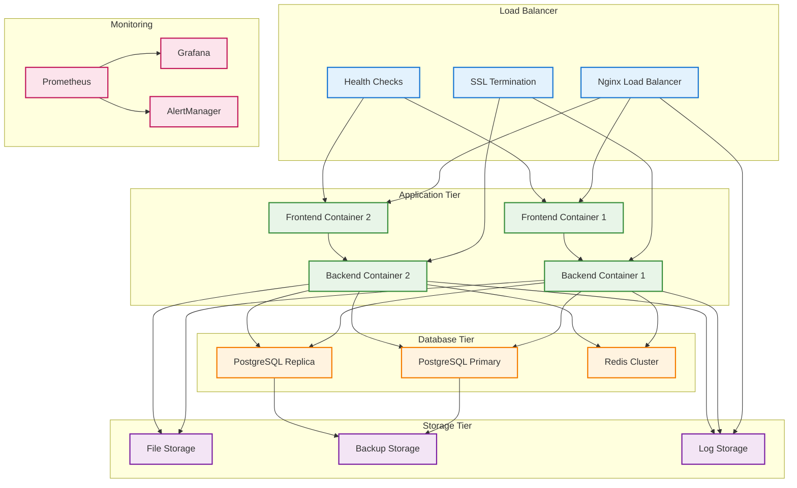
```mermaid
graph TB
    subgraph "Load Balancer"
        A[Nginx Load Balancer]
        B[SSL Termination]
        C[Health Checks]
    end

    subgraph "Application Tier"
        D[Frontend Container 1]
        E[Frontend Container 2]
        F[Backend Container 1]
        G[Backend Container 2]
    end

    subgraph "Database Tier"
        H[PostgreSQL Primary]
        I[PostgreSQL Replica]
        J[Redis Cluster]
    end

    subgraph "Storage Tier"
        K[File Storage]
        L[Backup Storage]
        M[Log Storage]
    end

    subgraph "Monitoring"
        N[Prometheus]
        O[Grafana]
        P[AlertManager]
    end

    A --> D
    A --> E
    B --> F
    B --> G
    C --> D
    C --> E
    D --> F
    E --> G
    F --> H
    G --> H
    F --> I
    G --> I
    F --> J
    G --> J
    F --> K
    G --> K
    H --> L
    I --> L
    A --> M
    F --> M
    G --> M
    N --> O
    N --> P

    %% Styling
    classDef lb fill:#E3F2FD,stroke:#1976D2,stroke-width:2px
    classDef app fill:#E8F5E8,stroke:#388E3C,stroke-width:2px
    classDef db fill:#FFF3E0,stroke:#F57C00,stroke-width:2px
    classDef storage fill:#F3E5F5,stroke:#7B1FA2,stroke-width:2px
    classDef monitoring fill:#FCE4EC,stroke:#C2185B,stroke-width:2px

    class A,B,C lb
    class D,E,F,G app
    class H,I,J db
    class K,L,M storage
    class N,O,P monitoring
```

---

## 📊 Monitoramento e Observabilidade

### 📈 Stack de Monitoramento

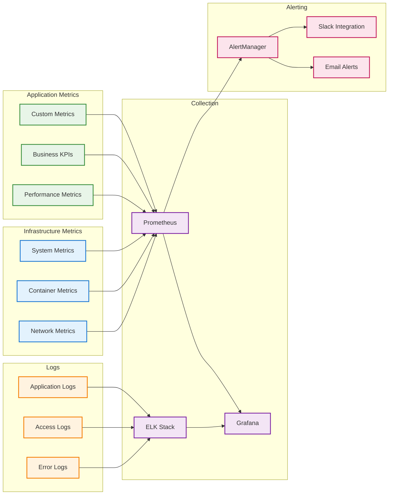
```mermaid
graph LR
    subgraph "Application Metrics"
        A[Custom Metrics]
        B[Business KPIs]
        C[Performance Metrics]
    end

    subgraph "Infrastructure Metrics"
        D[System Metrics]
        E[Container Metrics]
        F[Network Metrics]
    end

    subgraph "Logs"
        G[Application Logs]
        H[Access Logs]
        I[Error Logs]
    end

    subgraph "Collection"
        J[Prometheus]
        K[Grafana]
        L[ELK Stack]
    end

    subgraph "Alerting"
        M[AlertManager]
        N[Slack Integration]
        O[Email Alerts]
    end

    A --> J
    B --> J
    C --> J
    D --> J
    E --> J
    F --> J
    G --> L
    H --> L
    I --> L
    J --> K
    J --> M
    L --> K
    M --> N
    M --> O

    %% Styling
    classDef app fill:#E8F5E8,stroke:#388E3C,stroke-width:2px
    classDef infra fill:#E3F2FD,stroke:#1976D2,stroke-width:2px
    classDef logs fill:#FFF3E0,stroke:#F57C00,stroke-width:2px
    classDef collection fill:#F3E5F5,stroke:#7B1FA2,stroke-width:2px
    classDef alerting fill:#FCE4EC,stroke:#C2185B,stroke-width:2px

    class A,B,C app
    class D,E,F infra
    class G,H,I logs
    class J,K,L collection
    class M,N,O alerting
```

### 🔍 Health Check Architecture

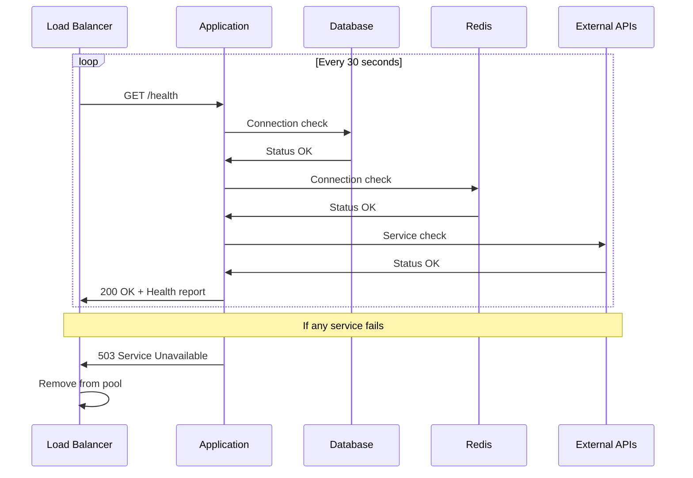
```mermaid
sequenceDiagram
    participant LB as Load Balancer
    participant APP as Application
    participant DB as Database
    participant CACHE as Redis
    participant EXT as External APIs

    loop Every 30 seconds
        LB->>APP: GET /health
        APP->>DB: Connection check
        DB->>APP: Status OK
        APP->>CACHE: Connection check
        CACHE->>APP: Status OK
        APP->>EXT: Service check
        EXT->>APP: Status OK
        APP->>LB: 200 OK + Health report
    end

    Note over LB,EXT: If any service fails
    APP->>LB: 503 Service Unavailable
    LB->>LB: Remove from pool
```

---

## 🔒 Arquitetura de Segurança

### 🛡️ Camadas de Segurança

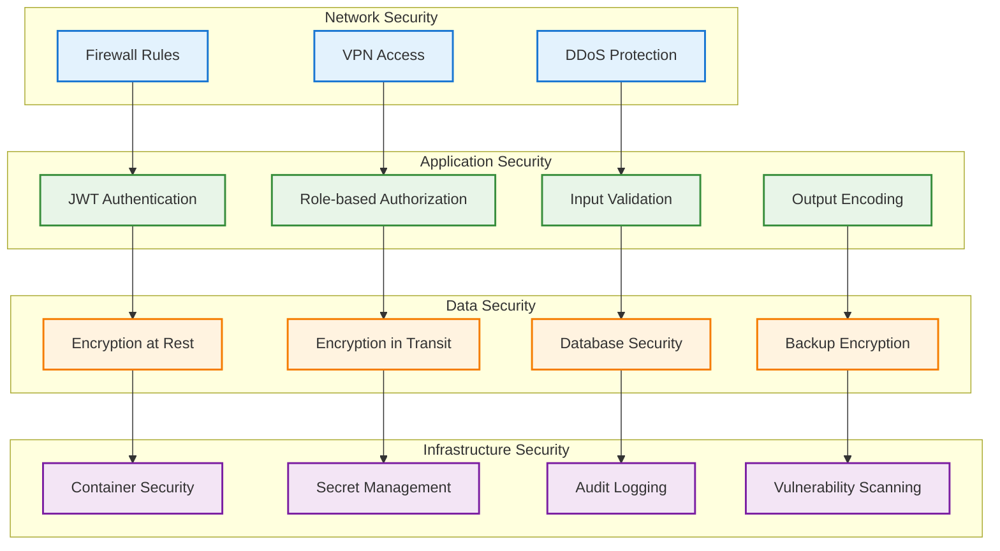
```mermaid
graph TB
    subgraph "Network Security"
        A[Firewall Rules]
        B[VPN Access]
        C[DDoS Protection]
    end

    subgraph "Application Security"
        D[JWT Authentication]
        E[Role-based Authorization]
        F[Input Validation]
        G[Output Encoding]
    end

    subgraph "Data Security"
        H[Encryption at Rest]
        I[Encryption in Transit]
        J[Database Security]
        K[Backup Encryption]
    end

    subgraph "Infrastructure Security"
        L[Container Security]
        M[Secret Management]
        N[Audit Logging]
        O[Vulnerability Scanning]
    end

    A --> D
    B --> E
    C --> F
    D --> H
    E --> I
    F --> J
    G --> K
    H --> L
    I --> M
    J --> N
    K --> O

    %% Styling
    classDef network fill:#E3F2FD,stroke:#1976D2,stroke-width:2px
    classDef application fill:#E8F5E8,stroke:#388E3C,stroke-width:2px
    classDef data fill:#FFF3E0,stroke:#F57C00,stroke-width:2px
    classDef infrastructure fill:#F3E5F5,stroke:#7B1FA2,stroke-width:2px

    class A,B,C network
    class D,E,F,G application
    class H,I,J,K data
    class L,M,N,O infrastructure
```

### 🔐 Fluxo de Autorização

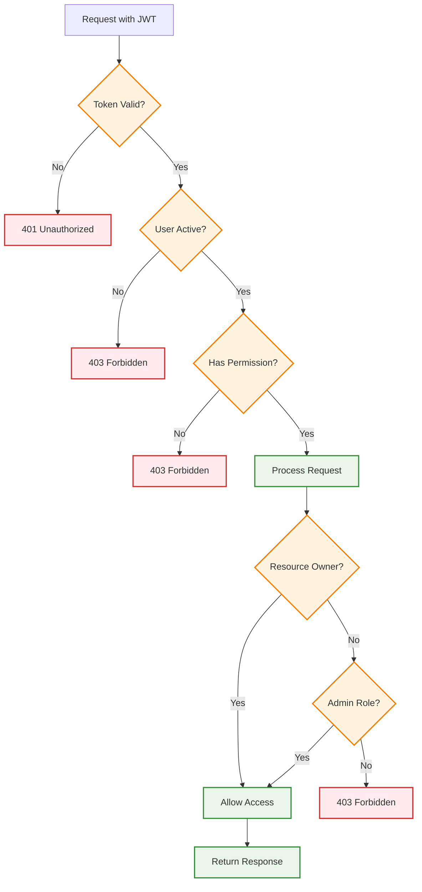
```mermaid
flowchart TD
    A[Request with JWT] --> B{Token Valid?}
    B -->|No| C[401 Unauthorized]
    B -->|Yes| D{User Active?}
    D -->|No| E[403 Forbidden]
    D -->|Yes| F{Has Permission?}
    F -->|No| G[403 Forbidden]
    F -->|Yes| H[Process Request]
    H --> I{Resource Owner?}
    I -->|No| J{Admin Role?}
    I -->|Yes| K[Allow Access]
    J -->|No| L[403 Forbidden]
    J -->|Yes| K
    K --> M[Return Response]

    %% Styling
    classDef decision fill:#FFF3E0,stroke:#F57C00,stroke-width:2px
    classDef error fill:#FFEBEE,stroke:#D32F2F,stroke-width:2px
    classDef success fill:#E8F5E8,stroke:#388E3C,stroke-width:2px

    class B,D,F,I,J decision
    class C,E,G,L error
    class H,K,M success
```

---

## 📋 Padrões e Convenções

### 🎯 Design Patterns Utilizados

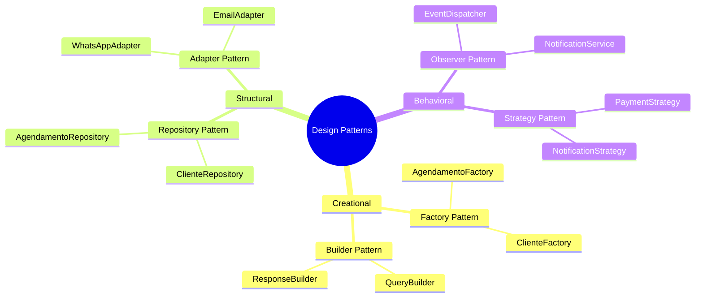
```mermaid
mindmap
  root((Design Patterns))
    Creational
      Factory Pattern
        ClienteFactory
        AgendamentoFactory
      Builder Pattern
        QueryBuilder
        ResponseBuilder
    Structural
      Repository Pattern
        ClienteRepository
        AgendamentoRepository
      Adapter Pattern
        WhatsAppAdapter
        EmailAdapter
    Behavioral
      Observer Pattern
        EventDispatcher
        NotificationService
      Strategy Pattern
        PaymentStrategy
        NotificationStrategy
```

### 📐 Convenções de Código

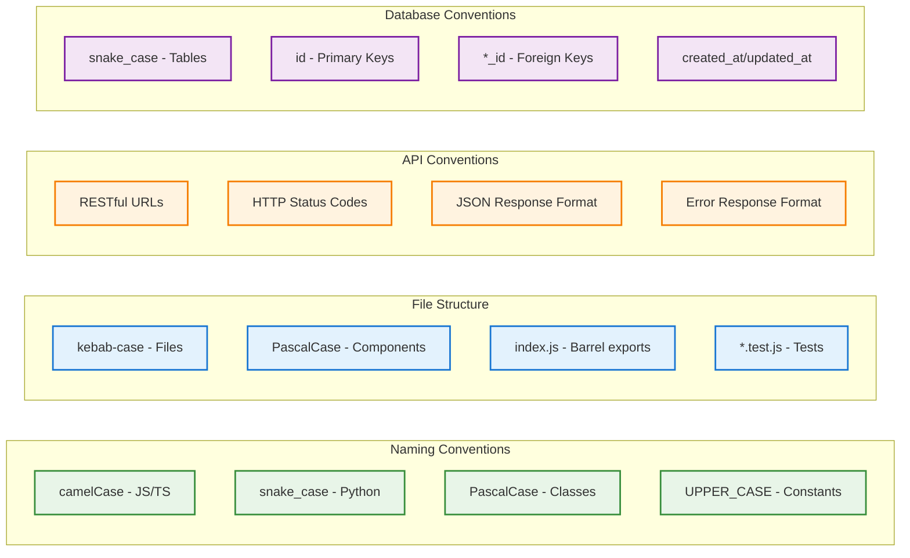
```mermaid
graph LR
    subgraph "Naming Conventions"
        A[camelCase - JS/TS]
        B[snake_case - Python]
        C[PascalCase - Classes]
        D[UPPER_CASE - Constants]
    end

    subgraph "File Structure"
        E[kebab-case - Files]
        F[PascalCase - Components]
        G[index.js - Barrel exports]
        H[*.test.js - Tests]
    end

    subgraph "API Conventions"
        I[RESTful URLs]
        J[HTTP Status Codes]
        K[JSON Response Format]
        L[Error Response Format]
    end

    subgraph "Database Conventions"
        M[snake_case - Tables]
        N[id - Primary Keys]
        O[*_id - Foreign Keys]
        P[created_at/updated_at]
    end

    %% Styling
    classDef naming fill:#E8F5E8,stroke:#388E3C,stroke-width:2px
    classDef files fill:#E3F2FD,stroke:#1976D2,stroke-width:2px
    classDef api fill:#FFF3E0,stroke:#F57C00,stroke-width:2px
    classDef database fill:#F3E5F5,stroke:#7B1FA2,stroke-width:2px

    class A,B,C,D naming
    class E,F,G,H files
    class I,J,K,L api
    class M,N,O,P database
```

---

## 🚀 Roadmap Arquitetural

### 📈 Evolução da Arquitetura

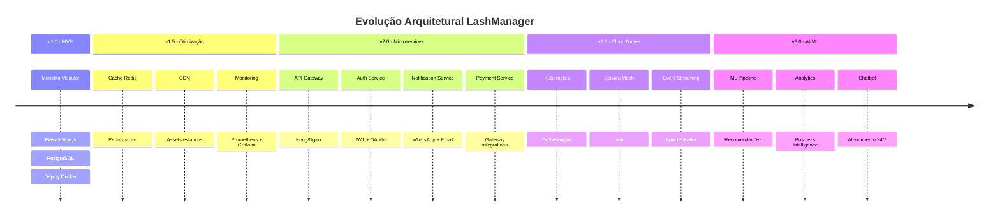
```mermaid
timeline
    title Evolução Arquitetural LashManager
    
    section v1.0 - MVP
        Monolito Modular : Flask + Vue.js
                         : PostgreSQL
                         : Deploy Docker
    
    section v1.5 - Otimização
        Cache Redis      : Performance
        CDN              : Assets estáticos
        Monitoring       : Prometheus + Grafana
    
    section v2.0 - Microservices
        API Gateway      : Kong/Nginx
        Auth Service     : JWT + OAuth2
        Notification Service : WhatsApp + Email
        Payment Service  : Gateway integrations
    
    section v2.5 - Cloud Native
        Kubernetes       : Orchestração
        Service Mesh     : Istio
        Event Streaming  : Apache Kafka
    
    section v3.0 - AI/ML
        ML Pipeline      : Recomendações
        Analytics        : Business Intelligence
        Chatbot          : Atendimento 24/7
```

### 🎯 Métricas de Arquitetura

```mermaid
graph LR
    subgraph "Performance"
        A[Response Time < 200ms]
        B[Throughput > 1000 RPS]
        C[CPU Usage < 70%]
        D[Memory Usage < 80%]
    end

    subgraph "Reliability"
        E[Uptime > 99.9%]
        F[Error Rate < 0.1%]
        G[MTTR < 5 minutes]
        H[MTBF > 30 days]
    end

    subgraph "Scalability"
        I[Horizontal Scaling]
        J[Auto-scaling]
        K[Load Distribution]
        L[Database Sharding]
    end

    subgraph "Security"
        M[Zero Vulnerabilities]
        N[Compliance LGPD]
        O[Audit Logging]
        P[Encryption Everywhere]
    end

    %% Styling
    classDef performance fill:#E8F5E8,stroke:#388E3C,stroke-width:2px
    classDef reliability fill:#E3F2FD,stroke:#1976D2,stroke-width:2px
    classDef scalability fill:#FFF3E0,stroke:#F57C00,stroke-width:2px
    classDef security fill:#FFEBEE,stroke:#D32F2F,stroke-width:2px

    class A,B,C,D performance
    class E,F,G,H reliability
    class I,J,K,L scalability
    class M,N,O,P security
```

---

**Desenvolvido com 💜 por Lila Rodrigues**

*Arquitetura técnica completa do LashManager v1.0*

**Última atualização**: 29/09/2025
**Próxima revisão**: Dezembro 2025

